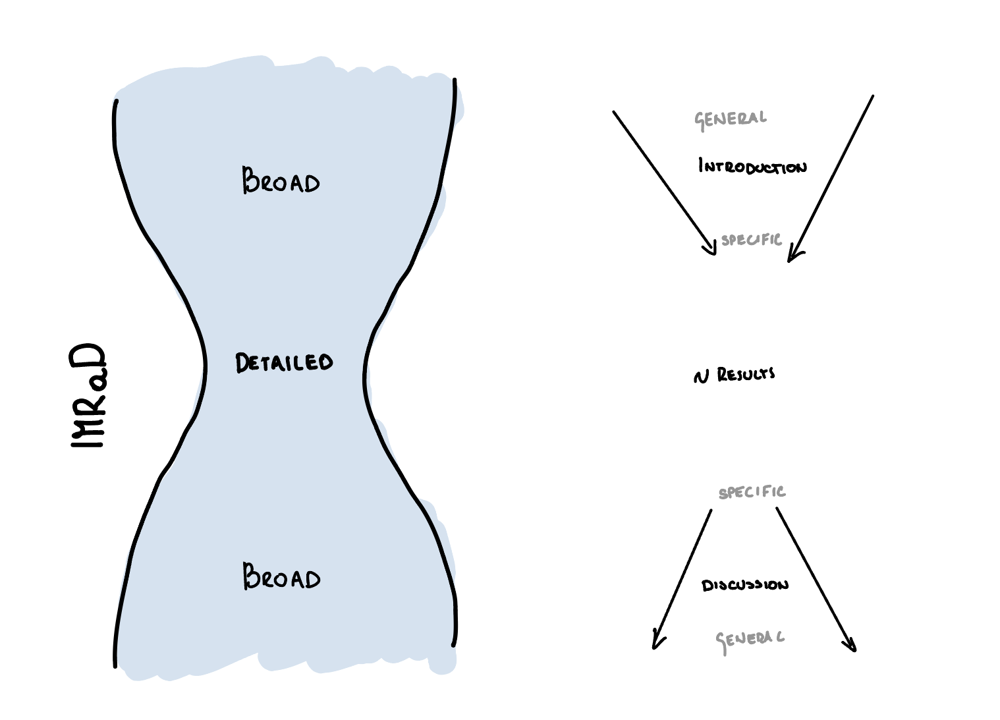

_This summary is based on the workshop on Scientific Writing given by Gaia Doneti. It is a paraphrased note, written together with Moritz Fontboté Schmidt, and extended with additional thoughts. Feel free to contribute directly via GitLab or contact wadamczyk@phys.ethz.ch_.

## Chapter 1: Why write about your research?
Before starting with the course, it is important to reflect on why writing matters. As humans, and especially as scientists, our role is to deeply understand ideas, experiment with them, and share them with others. Writing enables us to:

1. Help others understand ideas quicker than we did.
2. Allow others to verify and correct our understanding.
3. Enable others to make more educated guesses about the future direction of research.

### Writing with Intent

Writing should always be intentional and aligned with the specific goal. To achieve this, ask yourself:

- **What is my main message?** What do I want the reader to understand after reading my text?
- **Who is my audience?** How do I deliver the message effectively to this audience?
- **What do I want the reader to take home?** How should their understanding of the topic change?
- **What misconceptions do I want to avoid?** Identify potential misunderstandings or overstatements to ensure clarity.

### Additional Questions

- **What type of paper am I writing?** Understand the common types of papers (e.g., review, technical) and align your writing to the expectations of that category.


## Chapter 2: What Makes a 'Good' Paper?

### Characteristics of a "Bad" Paper

A "bad" paper is one that the reader struggles to follow. This often happens when:

- Too much prior knowledge is assumed, making the paper inaccessible.
- Ambiguities obscure the message.
- The focus is on "selling" rather than "communicating" the research.

### Characteristics of a "Good" Paper

A "good" paper avoids these pitfalls. Instead:

- **Notation:** Use notation consistent with the standard literature.
- **Clarity:** Ensure that the writing is unambiguous.
- **Communication:** Focus on conveying ideas clearly, not on overselling them.

## Chapter 3: Structure

Initially when writing a paper it is useful to follow some sort of structure. One commonly used framework is **IMRaD** (Introduction, Methods, Results, and Discussion), which follows the inverted-vase model:

<div style="text-align: center">

</div>

- **Introduction:** Broad context narrowing to the specific research question.
- **Methods:** Detailed explanation of the approach.
- **Results:** Presentation of findings guided by key figures.
- **Discussion:** Recap findings, discuss limitations, and connect to the broader field.

### Tips for Each Section

#### Introduction

- should give a context of the written work, but also general context for the whole field. It should be specific to the work, so don't try to introduce the whole field if its not relevant to the work. It also should also briefly introduce the findings of the work and how can they relate to the field. 
- Introduction should start with broad context and then go more specific:
  - Context: What is known, and what isn't. Where your study comes in?
  - Focus: Literature review, rationale and objectives of your work?
  - Findings: A preview (optional)
- If you're stuck, a useful trick is to start off by plagiarizing (if others do work very similar to yours). You can collect the patches, and then you can be inspired by them to write your own introduction. But here you need to be very careful about it. It is easy to forget what you have copied and then you can end up plagarising other people's work. It is useful to mark what you have copied and what you have written yourself.

#### Methods

- Key Questions to ask:
    - What details help the reader understand how you obtained your results?
    - Methods section are very varied depending on the journal and the field. Therefore if you are writing a method section, you should ask yourself about how are the methods written in both of those two contexts. It might be that the journal has a separate section for methods, or it might be that it is added as a supplement. You should also ask yourself what a common person in your field would expect to see in the methods section.
- It is common for people to by accident self-plagarise if they are including methods that are featured in other papers of theirs. Be careful about it.
- If there is not enough material for a methods section - exclude it - many journals do not require it.

#### Results
- Key Questions to ask:
    - What conclusions do I want to draw?
    - What data is crucial to draw those conclusions?
    - What figures do I need to present the data?
- Often quite easy way to write results section is to be guided by the plots. Think about what do you want to show and how in terms of the plots that should create a story line, and then work with text around the plots. 
- It is important to note that now it is customatory to allow the reader to read the plot and fully understand it without the need to read the text (Figures need to be independently understandable.)
- In the results when you are including a lot of numerical data - read it aloud - is it easy to read? If not, think how you can change it. 
- Quite often people are scared to comment on the data in the results section, as they want to include it in the discussion. But then it somehow creates gaps in the results section. It is fine to comment on the data in both section. In general repetition is fine as soon as it is not overdone. Feel free to comment on the data in both sections.

#### Discussion

- Discussion should be opposite to the introduction, it should start more specific and then go more broadly. 
  - Recap the findings, 
  - Then focus on the most important findings, what are puzzling outcomes, limitations, open questions
  - Outlook
- Similarily to the results section you can follow the inverted-vase model (by first doing a recap, then focus on the most important findings, and then talk more generally about the outlook).
- Include the limitations of the work in the discussion.

**General tips:**

- Repetition in papers is good quite often it makes the paper more readable.
- Storytelling - Galia argues we overuse the concept. By focusing too much on the story-telling it makes us less scientists and more a seller. 

## Chapter 4: Zoom - Paragraphs:

**Tips:**

- Paragraph should correspond to one idea. The idea should be clear and distinct from other paragraphs. To make sure that the paragraph corresponds to one idea it is useful to use topic sentences, and then during the revision ponder whether you are convaying the idea.
- It is common in readers that they put the most attention to the beginning and the end of the paragraph. Gaia compared the beggining and the end of the paragraph to a most expensive real estate. Use it wisely. This is where the reader's attention is.
- Parallelism / repetition can help with coherence (don't overdo).
- Use topic sentences to guide you during revision. (Highlight them?)
- Organisational scheme: It is useful to use some sort of organisational scheme when writing paragraphs. It can be spatial or temporal, general to specific, expected to un-expected, familiar to unfamiliar. By having some sort of structure it is easier for the reader to follow the text. You are in the same boat as the reader, both of you want the reader to understand the text.

**Red flags:**

  - Paragraphs that widely vary in length
  - Paragraphs that start with however, despite
  - Redundancies


## Chapter 5: Zoom - Sentences:

**Tips:**

- "Expensive real estate" - Similarly to paragraphs, the beggining and the end of the sentence are the most important part of it. Readers often skip the middle of the sentences. Therefore one should put the most important information in the beggining and the end of the sentence.
- "Old before new" - Start sentence with something familiar (make a connection to the previous sentence), and then end with emphasis on known information or introduce a new information (this rule is more for reviews, when you are re-writting sentences)
- Prioritise clarity of a message of a sentence:
  - Can you identify sentences' subject-verb-object core? Is it obscured or is it visible?
  - How long is the sentence? Don't be scared to use long sentences, but sometimes it can reduce the clarity of the sentence.
- "Lullaby effect" - Connection between sentences:
  - "Compared to", "Moreover"...
  - What kind of verbs are you using. And here one has to be careful not to use always the same verb, as it can cause something called _lullaby effect_.
- Tenses and voice:
  - Different tenses may be used, but frequent changes will confuse the reader.
  - Tenses have meaning: 
    - Too much future tense in outlook = unrealistic. 
    - Too much present tense = i'm certain 
  - Active vs Passive Voice: Be moderate, both are OK, but use passive only with good reason.

### Chapter 5.1. Sentences - unecessary complexity
- Confusion verbs:
  - It is common for people to use ambiguous verbs, such as 'novel' or 'utilize'. It is better to use more specific verbs, such as 'new' or 'use'.
- Misplaced modifiers:
  - Very common mistake in papers
  - <span style="color: red">"Rising 24000 meters into the atmosphere in only 15 minutes, scientists estimated the height of the ash cloud." vs "As scientists estimated, the ash cloud rose 24000 meters into the atmosphere in only 15 minutes."</span>
- Nominalisations:
  - <span style="color: red">"The stripping of the rainforests" vs "If the rainforest is stripped"</span>
- This and that:
  - Because people are really scared of reperitions, they often use this and that. This quite often causes confusion, as the text is then not refering clearly to one thing. When you use this, you need to make sure that it is clear what you are referring to.
- Technical words vs jargon:
  - Jargon is a unjustified use of technical words. It is useful to use technical words when they are justified.

## Chapter 6: Best Practices:
- There is no need for hype and firsts:
  - Avoid: breakthrough, holy grail, smoking gun, paradigm shift
  - Make sure to hedge claims to enhance your credibility (To the best of our knowledge, this is the first demonstration...) - objectivelly you are never sure if you are the first to do something.
- Acronyms:
  - Shouldn't be used too densely
  - Use the common ones from the field
- Figures
    - Refer to them in right order
    - Caption needs to be exhaustive: you shouldn't need to read the text
- References
    - cite papers that are usefull - recent vs older?
    - context dependent - cite an idea vs cite the explanation
    - I liked how Gaia was talking about being very mindfull what we refer to. The trick is somehow to be a curator that curates the best references for the others to use
- Beyond the main text - dont use suplementary material as a dump


## Random Tips:
- Blank page fear - copy random things
- clarity of citations - which one should i cite
- repetition of points is fine

<!-- 
## Chapter 7: Abstracts:
- keywords for google
- convince someone to take a closer look @ your paper
- Miniaturised papers (Mirror) and not summary
- Knows its audience
- Drafted first - pper revewed later
- Choice between what you say or what you dont say - concious decision
- Needs to have a clear idea about target audience

### Style of abstracts:
- Overview, Technical, Assertive, Peculiar
- Choosing style: andwers questions, main message of the paper - target audience, target journal defines the style for abstract


_Fun fact:  abstracts were not written by authors back in the day_

- They are not a formality or waste of time.
  -> what may convince someone to take a closer look
  -> they are searchable
  -> "display windows"

  ```
  Area          Key findings

                 Implications
  ```

- Miniaturized papers
  -> more about what is left out than what is included
  -> know your audience (more than paper!)
  -> may be drafted first, revised last

- Styles of abstracts:
  -> overview: past work, outlook
  -> technical (common in physics): report of work
  -> assertive (e.g. Supermancy): promotional abstract
  -> peculiar (that's our style)

Questions: main message? target audience? target journal? community style?

## Chapter 8: The tip of the paper iceaberg
- What are the most visible bits of a paper -> Title & Abstract -  -->


