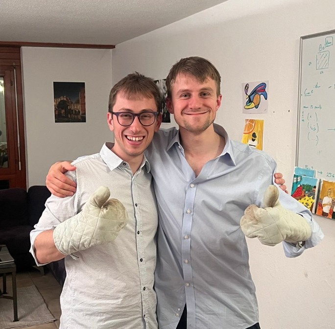

# About

Hi, I’m Wojciech Adamczyk - a PhD student in [Jonathan Home’s](https://tiqi.ethz.ch) group @ ETH Zurich, working on **calcium Rydberg atoms in tweezer arrays**. Previously, I worked with [Didier Queloz](https://www.lclu.cam.ac.uk) @ University of Cambridge on **measuring precipitable water vapor via remote sensing**, and with Hartmut Schlums @ Rolls‑Royce Deutschland on **multiaxial fatigue of Allvac 718Plus**. 

I’m currently interested in:

- atomic physics and motional state control
- off‑diagonal Hamiltonian elements
- optical aberrations
- maximum likelihood estimation methods
- AI safety research

I enjoy hacking, writing, and playing the violin.

## Supervision & contact
I deeply enjoy supervising Master’s and semester projects. And also random projects.

- Master’s students: apply via email to the TIQI application list: [tiqi-application@lists.phys.ethz.ch](mailto:tiqi-application@lists.phys.ethz.ch). Please mention my name in the application.
- If you want to work on something together: [wadamczyk@phys.ethz.ch](mailto:wadamczyk@phys.ethz.ch)

<!-- # Essays and Articles I Found Inspiring:
- [Paul Graham - Writing, Briefly](https://paulgraham.com/goodwriting.html)
- [Dario Amodei - Machines of Loving Grace](https://www.darioamodei.com/essay/machines-of-loving-grace)
- [Andrej Karpathy - A Survival Guide to a PhD](https://karpathy.github.io/2016/09/07/phd/) -->

# Blogs I like:

This website was created because of the immense joy I got from reading other people's websites such as:

- [Daniel Steck](https://steck.us)
- [Maciej Malinowski](https://m-malinowski.github.io/ideas/)
- [Piotr Migdal](https://p.migdal.pl)
- [David Tong](https://www.damtp.cam.ac.uk/user/tong/teaching.html)
- [Neel Nanda](https://www.neelnanda.io)
- [Pete Shadbolt](https://peteshadbolt.co.uk)
- [Scott Aaronson](https://scottaaronson.blog)
- [Paul Graham](https://paulgraham.com)
- [Dario Amodei](https://www.darioamodei.com)
- [Andrej Karpathy](https://karpathy.ai)