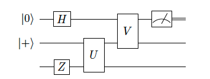

# Chapter 1b: Usefull Toolbox

## 1.6. Bell Basis
- Let $\mathcal{H}_{A B}=\mathcal{H}_A \otimes \mathcal{H}_B \cong \mathbb{C}^4$ be the bipartite Hilbert space of two qubits and consider the product basis of the computational bases of the qubit subsystems. For $\mathcal{H_{AB}}$ there exists a basis consisting of _maximally entangled states_ denotes as:

$$\begin{array}{ll}\left|\psi^{00}\right>=\frac{1}{\sqrt{2}}(\left|00\right>+\left|11\right>) & =\left|\Phi^{+}\right> \\ \left|\psi^{01}\right>=\frac{1}{\sqrt{2}}(\left|00\right>-\left|11\right>) & =\left|\Phi^{-}\right> \\ \left|\psi^{10}\right>=\frac{1}{\sqrt{2}}(\left|01\right>+\left|10\right>) & =\left|\Psi^{+}\right> \\ \left|\psi^{11}\right>=\frac{1}{\sqrt{2}}(\left|01\right>-\left|10\right>) & =\left|\Psi^{-}\right>\end{array}$$

- The first number stands for parity, the second number stands for phase. $\left|\psi^{10}\right>$ has parity 1 (odd number of 1's), and relative phase $(-1)^0=1$
- The maximally entangled states are locally convertible - there exist local operations on the subsystem B that transforms one Bell state into another Bell state.
$$\left|\psi^{i j}\right>=\left(\mathbb{I}_A \otimes X_B^i Z_B^j\right)\left|\psi^{00}\right>$$

## 1.7. Quantum Circuits
**Example Quantum circuit**

 

corresponds to unitary operator $\left(V \otimes \mathbb{I}\right)\left(\mathbb{I}\otimes U\right)\left(H\otimes\mathbb{I}\otimes Z\right)$ applied to three qubits followed by a Z-measurement of the first qubit

**Common Gates**

- Haddamard Gate:
    - $H=\frac{1}{\sqrt{2}}\left(\begin{array}{cc}1 & 1 \\ 1 & -1\end{array}\right)=\left|+\right>\left< 0\right|+\left|-\right> \left<1\right|=\left| 0\right>\left<+\right|+\left| 1\right>\left<-\right|$
    - As an orthogonal transformation in the real Euclidean plane $\mathbb{R}^2$, H is reflection in the mirror line at angle $\frac{\pi}{8}$ to the x-axis
- X, Y, Z:
    - $X = \left(\begin{array}{ll} 0 & 1 \\ 1 & 0 \end{array}\right)$, $Z = \left(\begin{array}{ll} 1 & 0 \\ 0 & -1 \end{array}\right)$, $Y = \left(\begin{array}{ll} 0 & 1 \\ -1 & 0 \end{array}\right)$
- Controlled-U Gate:
    - $\mathrm{C} U=\left|0\right>\left<0\right|\otimes \mathrm{id}+\left| 1\right>\left<1\right| \otimes U$
- Controlled-Not Gate:
    - $\mathrm{CNOT}=\left(\begin{array}{llll}1 & 0 & 0 & 0 \\ 0 & 1 & 0 & 0 \\ 0 & 0 & 0 & 1 \\ 0 & 0 & 1 & 0\end{array}\right)=\left|0 \right>\left< 0\right| \otimes \mathbb{I}+\left|1\right>\left<1\right| \otimes X$

