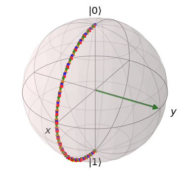

# Chapter 1b: Usefull Toolbox

## 1.6. Bloch Sphere:
- Because in my class there are a lot of non-physicists I thought it would be useful to introduce the concept of the Bloch Sphere. 
- _Bloch Sphere_ is just a common representation of a two level system, which allows one to think about the states and operations in a more intuitive way
- Normally when one thinks about how many parameters one needs to define a two level system, they can naively thing 4. In the end two level system lives in $\left|\psi\right> \in \mathbb{C}^2$. In different words, any _pure state_ can be written as a superposition of the basis vectors $\left|0\right>$ and $\left|1\right>$, where the coefficient of each of the two basis vectors is a complex number. $\left|\psi\right> = a_1e^{i\theta_1} \left|0\right> +  a_2e^{i\theta_2} \left|1\right>$. 4-parameters right?
    - We know, however, that the norm of a _pure state_ must equal to 1, which means that $\left<\psi|\psi\right> = 1 $, and so $\left|a_1\right|^2 + \left|a_2\right|^2=1$. This reduces the number of free parameters to 3
    - We also know that we dont care about the global phase of a state, as it doesn't change anything about our measurement, and so we can also neglect one degree of freedom, which reduces the number of free parameters to 2
    - This means that we can represent any 2-level quantum pure state on a unit sphere, which we will call Bloch Sphere
- How does one parametrise something on a unit-sphere?
    - One can do it with angles, $\theta \text{ and } \phi$
    - $\left|\psi\right> = \cos\frac{\theta}{2} \left|0\right> +  e^{i\phi}\sin{\frac{\theta}{2}} \left|1\right>$
    - In such representation the probability of measuring state $\left|0\right>$ is: $\left<0|\psi\right> = \cos^2\frac{\theta}{2}$, and to measure state $\left|1\right>$ is $\sin^2\frac{\theta}{2}$
    - $\left|\psi\right>$ can be represented on a unit sphere as:

 
- Any Unitary Operator then will be some sort of rotation of this state, mapping it from one point on this sphere to another point on this sphere - you will see it in the subchapter Quantum Circuits

## 1.7. Bell Basis
- Let $\mathcal{H}_{A B}=\mathcal{H}_A \otimes \mathcal{H}_B \cong \mathbb{C}^4$ be the bipartite Hilbert space of two qubits and consider the product basis of the computational bases of the qubit subsystems. For $\mathcal{H_{AB}}$ there exists a basis consisting of _maximally entangled states_ denotes as:

$$\begin{array}{ll}\left|\psi^{00}\right>=\frac{1}{\sqrt{2}}(\left|00\right>+\left|11\right>) & =\left|\Phi^{+}\right> \\ \left|\psi^{01}\right>=\frac{1}{\sqrt{2}}(\left|00\right>-\left|11\right>) & =\left|\Phi^{-}\right> \\ \left|\psi^{10}\right>=\frac{1}{\sqrt{2}}(\left|01\right>+\left|10\right>) & =\left|\Psi^{+}\right> \\ \left|\psi^{11}\right>=\frac{1}{\sqrt{2}}(\left|01\right>-\left|10\right>) & =\left|\Psi^{-}\right>\end{array}$$

- The first number stands for parity, the second number stands for phase. $\left|\psi^{10}\right>$ has parity 1 (odd number of 1's), and relative phase $(-1)^0=1$
- The maximally entangled states are locally convertible - there exist local operations on the subsystem B that transforms one Bell state into another Bell state.
$$\left|\psi^{i j}\right>=\left(\mathbb{I}_A \otimes X_B^i Z_B^j\right)\left|\psi^{00}\right>$$

## 1.8. Quantum Circuits
**Example Quantum circuit**

 

corresponds to unitary operator $\left(V \otimes \mathbb{I}\right)\left(\mathbb{I}\otimes U\right)\left(H\otimes\mathbb{I}\otimes Z\right)$ applied to three qubits followed by a Z-measurement of the first qubit

**Common Gates**

- Haddamard Gate:
    - $H=\frac{1}{\sqrt{2}}\left(\begin{array}{cc}1 & 1 \\ 1 & -1\end{array}\right)=\left|+\right>\left< 0\right|+\left|-\right> \left<1\right|=\left| 0\right>\left<+\right|+\left| 1\right>\left<-\right|$
    - As an orthogonal transformation in the real Euclidean plane $\mathbb{R}^2$, H is reflection in the mirror line at angle $\frac{\pi}{8}$ to the x-axis
     
- X, Y, Z:
    - $X = \left(\begin{array}{ll} 0 & 1 \\ 1 & 0 \end{array}\right)$, $Z = \left(\begin{array}{ll} 1 & 0 \\ 0 & -1 \end{array}\right)$, $Y = \left(\begin{array}{ll} 0 & 1 \\ -1 & 0 \end{array}\right)$
    - X-gate
    -  
    - Y-gate
    -  
    - Z-gate
    -  
- Controlled-U Gate:
    - $\mathrm{C} U=\left|0\right>\left<0\right|\otimes \mathrm{id}+\left| 1\right>\left<1\right| \otimes U$
- Controlled-Not Gate:
    - $\mathrm{CNOT}=\left(\begin{array}{llll}1 & 0 & 0 & 0 \\ 0 & 1 & 0 & 0 \\ 0 & 0 & 0 & 1 \\ 0 & 0 & 1 & 0\end{array}\right)=\left|0 \right>\left< 0\right| \otimes \mathbb{I}+\left|1\right>\left<1\right| \otimes X$

