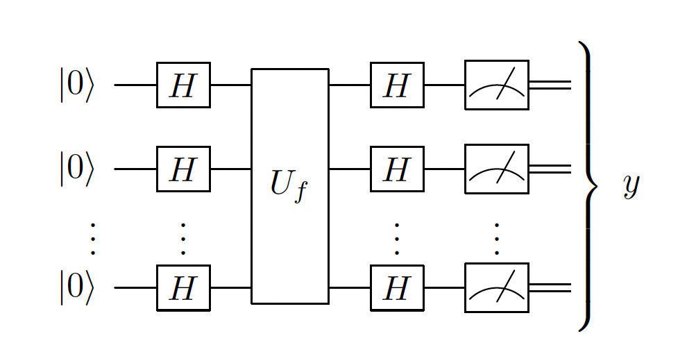

# Chapter 2b: Universal gates, Reversible irreversability, DJ algorithm

## 2.5. Universal sets of gates
- $\mathcal{S}$ is _universal set of gates for quantum computing_ if for any $n \in \mathbb{N}$ an arbitrary unitary operation $U \in \mathcal{U}(n)$ can be implemented to arbitrary precision using only elementary gates from $\mathcal{S}$
- Elementary gates are assumed to take time $O(1)$
- Examples of the universal set of gates:
    - $\{CNOT\} \cup \mathcal{U}(2)$
    - $\{CNOT, H, T\}$
    - $\{\text{Toffoli}, H\}$
- For any fixed universal set $\mathcal{S}$, a generic unitary matrix on _n_ qubits requires exponentially many elementary gates _n_ to be implemented - this follows from the fact that an n-qubit unitary is determined by $O(4^n)$ real parameters
- Goal of quantum computing is to find efficient quantum circuits which use poly(n) qubits and poly(n) elementary gates to solve a problem on an input size _n_

## 2.6. Simulating Classical Circuits $\left(\mathbf{B P P} \subset \mathbf{B Q P}\right)$
- A _classical circuit_ is a sequence of logical operations that act on a small number of bits (AND, OR, NOT)
- We claim that quantum computation is at least as powerfull as classical computation $\mathbf{B P P} \subset \mathbf{B Q P}$
- Difficulty arises when trying to translate irreversible logical operations such as AND or OR. Quantum operations are unitary, hence reversible. This poses a problem.
- The crucial step in showing that one can simulate any classical circuit with a quantum circuit involves showing that any classical boolean operation (even irreversible) can be represented through reversible operation on larger space
- The key point is that if we operate with unitaries on a larger space, but we only look at the subspace, it will look like the operation is non-unitary, (irreversible)
- If $f: B_m \rightarrow B_n$ is a Boolean function it can be expressed in an equivalent _reversible_ form $\tilde{f}: B_{m+n} \rightarrow B_{m+n}$.
    - to do this we introduce an addition operation $\oplus$, which is operation of adding mod 2
    - for any $f: B_m \rightarrow B_n$ define $\tilde{f}:B_{m+n}\rightarrow B_{m+n}$, where $\tilde{f}(b, c)=(b, c \oplus f(b))$
    - such function is reversible, as applying the function twice results in $(b, c \oplus f(b) \oplus f(b)) = (b, c \oplus 0...0) = (b, c)$
    - it performs the wanted operation, because if c is initialised with $c=0...0$, then $\tilde{f}(b, c) = (b, f(b))$
- By replacing all (now reversible) classical gates with quantum gates and imputing computation basis states, one can obtain quantum circuit that simulates the classical one 

## 2.7. Oracle for Boolean function:
- A _quantum oracle for any Boolean function_ $f:B_n\rightarrow B_m$ will be the quantum gate denoted $O_f$ on $n+m$ qubits defined by its action on basis states as follows 
$$
O_f\left|x\right>\left|y\right>=\left|x\right>\left|y \oplus f(x)\right> \quad \text { for all } x \in B_n \text { and } y \in B_m
$$
- Sometimes we refer to n-qubit register $\left|x\right>$ and the m-qubit register $\left|y\right>$ as the _input_ and _output_ registers respectively
- A _phase oracle_ will be quantum gate denoted $U_f$ on $n+m$ qubits defined by its action on basis states as follows 
$$
U_f\left|x\right>=(-1)^{f(x)}\left|x\right>
$$

- This can be achieved through $O_f$
$$
O_f\left|-\right>\left|x\right>=O_f \frac{1}{\sqrt{2}}(\left|0\right>-\left|1\right>)\left|x\right>=\frac{1}{\sqrt{2}}(\left|f(x)\right>\left|x\right>-\left|1 \oplus f(x)\right>\left|x\right>)=(-1)^{f(x)}\left|-\right>\left|x\right>
$$

## 2.8. Deutsch-Josza (DJ) algorithm:
- **Problem:** Given a function $f : \{0,1\}^n \rightarrow \{0, 1\}$ with a promise that a function is either _constant_ or _balanced_ the goal is to find out whether $f$ is constant or balanced. _Balanced_ means that it outputs 0 half of the time and 1 the other half of the time. _Constant_ means that it always outputs the same thing (either 1 or 0).
- Classical algorithm will require exponentially many queries to $f$, namely $2^{n-2}$ on average
- Quantum algorithm is able to determine whether f is constant or balanced in a single query
- **Algorithm**:
    - 
    - Which corresponds to $H^{\otimes n} U_f H^{\otimes n}\left|0\right>^{\otimes n}$
    - We then evaluate the probability of $y = 0^n$, which is equivalent to projecting the state onto $\left|0\right>^{\otimes n}$
    - $\left<0\right|^{\otimes n}H^{\otimes n} U_f H^{\otimes n}\left|0\right>^{\otimes n} = \begin{cases}1, & \text { if } f \text { is constant } \\ 0, & \text { if } f \text { is balanced }\end{cases}$ 
- **Explanation 1:**
    - Here the trick is to realise that operator can act either to the right or to the left. Acting on the left massively simplifies the problem:

    $$
    \left<0\right|^{\otimes n}H^{\otimes n} U_f H^{\otimes n}\left|0\right>^{\otimes n} = \left(\frac{1}{\sqrt{2^n}} \sum_{x \in\{0,1\}^n}\left<x\right|\right) U_f \left(\frac{1}{\sqrt{2^n}} \sum_{x' \in\{0,1\}^n}\left|x'\right>\right) = \frac{1}{2^n} \sum_{x \in\{0,1\}^n}\left<x\right| U_f \left|x\right> = \begin{cases}1, & \text { if } f \text { is constant } \\ 0, & \text { if } f \text { is balanced }\end{cases}
    $$

    - Because we have equal superposition of all x-values, then if $U_f$ is balanced then they will all add up to 0, and if they are constant, they will add up to 1
    - In fact quite often when we have some sort of symmetric situation due to the measurement - the problem massively simplifies
- **Explanation 2:**
    - Second explanation is more visual approach to the problem. It requires us to think about the problem slightly differently, which initially might seem more complicated, but then it becomes easier and more natural - I think it is very useful in subsequent problems such as Grover's algorithm
    - We can represent each n-qubit computational basis state as a number corresponding to its binary value 
        - $\left|0\right>_C = \left|00...0\right>=\left|0\right>^{\otimes n}$, 
        - $\left|1\right>_C = \left|00...01\right>$, 
        - $\left|2\right>_C = \left|00...10\right>$
        - ⋮
        - $\left|2^n-1\right> = \left|11...1\right>$
    - Each quantum state $\left|x\right>_C$ can be represented as a delta function $\delta(x)$ on the x-axis, where $x$ ranges from 0 to $2^n-1$.
    - Then let's run through the algorithm step by step:
        1. Initially we have the state $\left|0\right>_C$
        - 
        2. Then we apply Haddamard on the $\left|0\right>_C$ state, which results in the equal superposition of all states in $\left|x\right>_C$ basis
        - 
        3. Then we apply $U_f$ operator, which effectively flips the phase of half of the $\left|x\right>$ states if its balanced, otherwise it flips either all or none of them
        - 
        4. Finally we project it onto the equal superposition of all $\left|x\right>_C$ states
        - 
    - The result is that if half of the states are flipped, then when we project it onto the equal superposition of all $\left|x\right>_C$ states, we will measure it with probability 0, and if all the states are flipped, then we will measure it with probability 1

    

