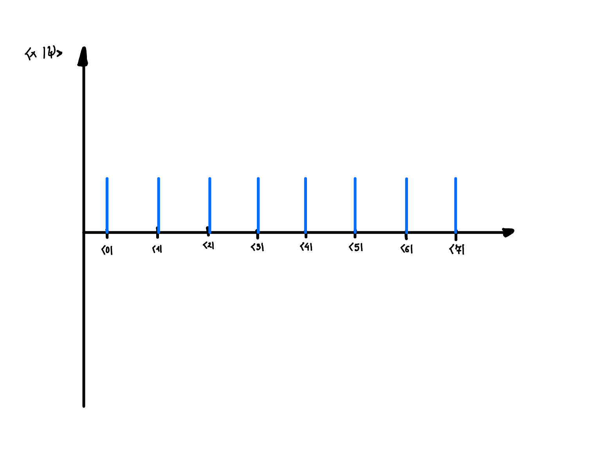

# DJ Style Algorithms:

## 4.1. Deutsch-Josza (DJ) algorithm:
- **Problem:** Given a function $f : \{0,1\}^n \rightarrow \{0, 1\}$ with a promise that a function is either _constant_ or _balanced_ the goal is to find out whether $f$ is constant or balanced. _Balanced_ means that it outputs 0 half of the time and 1 the other half of the time. _Constant_ means that it always outputs the same thing (either 1 or 0).
- Classical algorithm will require exponentially many queries to $f$, namely $2^{n-2}$ on average
- Quantum algorithm is able to determine whether f is constant or balanced in a single query
- **Algorithm**:
    - 
    - Which corresponds to $H^{\otimes n} U_f H^{\otimes n}\left|0\right>^{\otimes n}$
    - We then evaluate the probability of $y = 0^n$, which is equivalent to projecting the state onto $\left|0\right>^{\otimes n}$
    - $\left<0\right|^{\otimes n}H^{\otimes n} U_f H^{\otimes n}\left|0\right>^{\otimes n} = \begin{cases}1, & \text { if } f \text { is constant } \\ 0, & \text { if } f \text { is balanced }\end{cases}$ 
- **Explanation 1:**
    - Here the trick is to realise that operator can act either to the right or to the left. Acting on the left massively simplifies the problem:

    $$
    \left<0\right|^{\otimes n}H^{\otimes n} U_f H^{\otimes n}\left|0\right>^{\otimes n} = \left(\frac{1}{\sqrt{2^n}} \sum_{x \in\{0,1\}^n}\left<x\right|\right) U_f \left(\frac{1}{\sqrt{2^n}} \sum_{x' \in\{0,1\}^n}\left|x'\right>\right) = \frac{1}{2^n} \sum_{x \in\{0,1\}^n}\left<x\right| U_f \left|x\right> = \begin{cases}1, & \text { if } f \text { is constant } \\ 0, & \text { if } f \text { is balanced }\end{cases}
    $$

    - Because we have equal superposition of all x-values, then if $U_f$ is balanced then they will all add up to 0, and if they are constant, they will add up to 1
    - In fact quite often when we have some sort of symmetric situation due to the measurement - the problem massively simplifies
- **Explanation 2:**
    - Second explanation is more visual approach to the problem. It requires us to think about the problem slightly differently, which initially might seem more complicated, but then it becomes easier and more natural - I think it is very useful in subsequent problems such as Grover's algorithm
    - We can represent each n-qubit computational basis state as a number corresponding to its binary value 
        - $\left|0\right>_C = \left|00...0\right>=\left|0\right>^{\otimes n}$, 
        - $\left|1\right>_C = \left|00...01\right>$, 
        - $\left|2\right>_C = \left|00...10\right>$
        - ⋮
        - $\left|2^n-1\right> = \left|11...1\right>$
    - Each quantum state $\left|x\right>_C$ can be represented as a delta function $\delta(x)$ on the x-axis, where $x$ ranges from 0 to $2^n-1$.
    - Then let's run through the algorithm step by step:
        1. Initially we have the state $\left|0\right>_C$
            - 
        2. Then we apply Haddamard on the $\left|0\right>_C$ state, which results in the equal superposition of all states in $\left|x\right>_C$ basis
            - 
        3. Then we apply $U_f$ operator, which effectively flips the phase of half of the $\left|x\right>_C$ states if its balanced, otherwise it flips either all or none of them
            - 
        4. Finally we project it onto the equal superposition of all $\left|x\right>_C$ states
            - 
    - The result is that if half of the states are flipped, then when we project it onto the equal superposition of all $\left|x\right>_C$ states, we will measure it with probability 0, and if all the states are flipped, then we will measure it with probability 1

    

