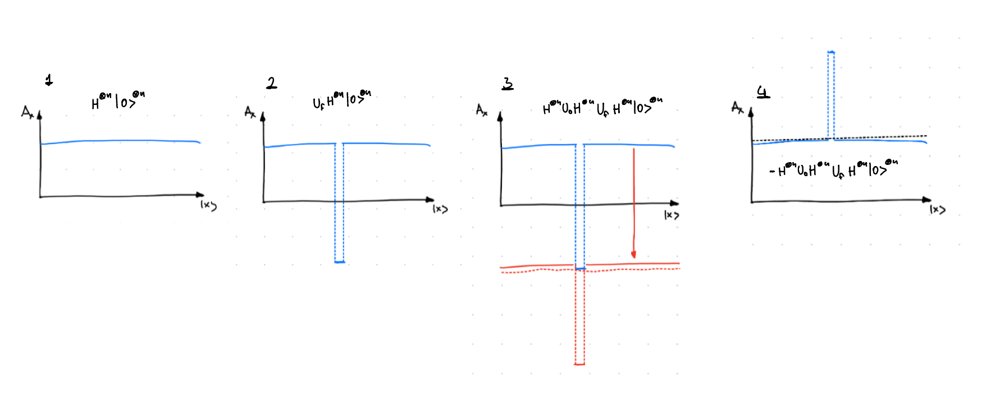

# Chapter 4b: Grover's Style Algorithms:

## 4.2. Grover's algorithm:
**Problem - Unstructured search**: Given an access to a computable function $f(x) : \{0,1\}^n \rightarrow \{0,1\}$ we want to find some $x$ such that $f(x_0) = 1$, for a unique 'marked' element $x_0\in\{1,...,N\}$.

Grover's algorithm is an algorithm which has a large range of applications and is a beautiful example of how quantum mechanics allows us to speed up many problems. But, in words of Scott Aaronson,  the speed up is rather modest, as it is only quadratic. 

Consider above problem in the classical setting. On average one would have to query $N/2$ elements to find the marked one, which means that the average time complexity is $O(N)$. In contrast, quantum algorithm will be able to find the marked element in $O(\sqrt{N})$ time. In the chapter below we will try to see how it is achieved.

### Algorithm:

This circuit corresponds to:
1. Applying $\left(-H^{\otimes n} U_0 H^{\otimes n} U_f\right)^{N_{\text {optimal }}} H^{\otimes n} \left|0\right>^{\otimes n}$
2. Measuring the resulting state

### Why it works?:
I would like to present here two geometric explanations why Grover's algorithm works. I would recommend you to think about both of them, as both of them allow you to understand different things about the algorithm.

**Explanation 1: Amplitude amplification**

Before we start with the explanation, let's re-write the operators in Grover's algorithm in a slightly different way. 

- Lets define:
  - $\left|g\right> = \left|x_0\right>$
  - $\left|b\right> = \frac{1}{\sqrt{N-1}} \sum_{x\neq x_0} \left|x\right> = \frac{\sqrt{N}}{\sqrt{N-1}}\left|+\right> - \frac{1}{\sqrt{N-1}} \left|g\right>$
  - $\left|+\right> = \frac{1}{\sqrt{N}} \sum_x \left|x\right> = H^{\otimes n} \left|0\right>^{\otimes n} = \frac{1}{\sqrt{N}}\left|g\right> + \frac{\sqrt{N-1}}{\sqrt{N}}\left|b\right>$
- $U_f$ is just a phase oracle, which flips the phase of the marked element. We can rewrite it as $U_f = I - 2 \left|x_0\right>\left<x_0\right|$
- $U_0$ flips the phase of the $\left|0\right>^{\otimes n}$ state. This means that $H^{\otimes n} U_0 H^{\otimes n} = H^{\otimes n} \left(I - 2 \left|0\right>\left<0\right|^{\otimes n}\right) H^{\otimes n} = I - 2 \left|+\right>\left<+\right|$

Therefore the circuit can be re-writen as:

$$
\left(-\underbrace{\left(I - 2\left|+\right>\left<+\right|\right)}_{H^{\otimes n} U_0 H^{\otimes n}}\underbrace{\left(I - 2\left|g\right>\left<g\right|\right)}_{U_f}\right)^{N_{\text {optimal }}} \left|+\right>
$$

Let's consider then the action of the operator on the plus state $\left|+\right>$:

$$
\begin{aligned}
-\left(I - 2\left|+\right>\left<+\right|\right)\left(I - 2\left|g\right>\left<g\right|\right)\left|+\right> 
&= -\left(I - 2\left|+\right>\left<+\right|\right)\left(\left|+\right> - \frac{2}{\sqrt{N}}\left|g\right>\right) 
\\&= -\left(\left|+\right> - \frac{2}{\sqrt{N}}\left|g\right> - 2\left|+\right> + \frac{4}{N} \left|+\right>\right) 
\\&= \left(\left(1 - \frac{4}{N}\right)\left|+\right> + \frac{2}{\sqrt{N}}\left|g\right>\right)
\end{aligned}
$$

This can be visualised as:

We can see how each step of the algorithm has a specific purpose. 
- $U_f$ is an operation that flips the phase of the target state. 
- $H^{\otimes n} U_0 H^{\otimes n}$ when applied to $\left|\psi\right>$ performs interference between the wavefunction $\left|\psi\right>$ and $-2\left|+\right>\left<+|\psi\right>$, effectively shifting the whole wavefunction down by $2\left|+\right>\left<+|\psi\right>$.
- Minus sign inverts the amplitude of the wavefunction, and is done only for convenience of thinking about the algorithm, but has no real purpose. 

One can spot now the problem with Grover's algorithm. The approach only works when the phase of marked element is the same as the phase of non-marked elements. Consider an example where exactly such situation occurs.

Then instead of the amplitude amplification we will get amplitude destruction. Will it ever occur? Well yes, if we keep going with the algorithm we will see that the second operator shifts the wavefunction by $2\left|+\right>\left<+|\psi\right>$. For 

$$
\left|\psi\right> = \alpha\left|g\right> + \beta\left|b\right> = \alpha\left|g\right> + \beta \left(\frac{\sqrt{N}}{\sqrt{N-1}}\left|+\right> - \frac{1}{\sqrt{N-1}} \left|g\right>\right) = \left(\alpha - \frac{\beta}{\sqrt{N-1}}\right)\left|g\right> + \beta\frac{\sqrt{N}}{\sqrt{N-1}}\left|+\right>
$$

we will get shift of 

$$
- 2\beta\frac{\sqrt{N}}{\sqrt{N-1}} + 2\beta\frac{1}{\sqrt{N}\sqrt{N-1}} - 2\alpha\frac{1}{\sqrt{N}}
$$

**Explanation 2: Amplitude amplification (Geometrically)**

**Explanation 3: Rotations around 2D-plane**=
