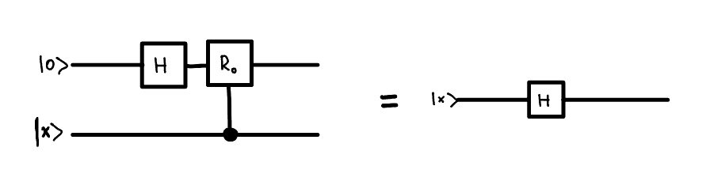
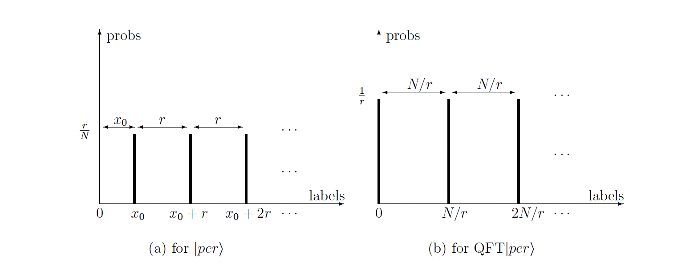

# Chapter 4c: Quantum Fourier Transform, Period Finding Algorithm:

## 4.3. Discrete Fourier Transform and Quantum Fourier Transform:
_Quantum Fourier Transform (QFT) in dimension N_: defined on the computational basis $\{\left|x\right> \}^{N-1}_{x=0}$ as the map:

$$
\mathcal{Q}_N\left|x\right> := \frac{1}{\sqrt{N}} \sum_{y=0}^{N-1} \left( e^{2\pi i /N } \right)^{xy} \left|y\right>
$$

, where $xy$ is a product of two integers

This is rather straighforward definition, and it is not so different from the classical Discrete Fourier Transform. Few examples of the QFT matrices for different dimensions are:

$$
Q_2=\frac{1}{\sqrt{2}}\left(\begin{array}{cc}
1 & 1 \\
1 & -1
\end{array}\right), \quad Q_3=\frac{1}{\sqrt{3}}\left(\begin{array}{ccc}
1 & 1 & 1 \\
1 & e^{2 \pi i / 3} & e^{-2 \pi i / 3} \\
1 & e^{-2 \pi i / 3} & e^{2 \pi i / 3}
\end{array}\right), \quad Q_4=\frac{1}{2}\left(\begin{array}{cccc}
1 & 1 & 1 & 1 \\
1 & i & -1 & -i \\
1 & -1 & 1 & -1 \\
1 & -i & -1 & i
\end{array}\right)
$$

Let's focus on the matrix $\mathcal{Q}_4$, and try to understand how it transforms a vector $\left|x\right>$. To do this we should consider first the matrix multiplication. When one multiplies the matrix $\mathcal{Q}_4$ with a vector $x$, $\left(y = \mathcal{Q}_4 x\right)$, then for each element of $y$, one performs a dot product of $x$ with the i-th row of the matrix. As each consecutive row of the matrix is a vector that rotates in complex space with some angular frequency, the dot product effectively picks up, the component of $x$ with this given angular frequency i.e. performs a Fourier Transform.

We can see the pattern of this matrix - first row is a vector that roates with angular frequency of $0 \frac{2\pi}{4}$, second row with angular frequency of $1 \frac{2\pi}{4}$, third row with angular frequency of $2\frac{2\pi}{4}$ and the last row with angular frequency of $3\frac{2\pi}{4}$. 

More generally, the QFT can be written as a following matrix:

$$
\mathcal{Q}_N=\frac{1}{\sqrt{N}}\left(\begin{array}{cccccc}
1 & 1 & 1 & 1 & \cdots & 1 \\
1 & \omega & \omega^2 & \omega^3 & \cdots & \omega^{N-1} \\
1 & \omega^2 & \omega^4 & \omega^6 & \cdots & \omega^{2(N-1)} \\
1 & \omega^3 & \omega^6 & \omega^9 & \cdots & \omega^{3(N-1)} \\
\vdots & \vdots & \vdots & \vdots & & \vdots \\
1 & \omega^{N-1} & \omega^{2(N-1)} & \omega^{3(N-1)} & \cdots & \omega^{(N-1)(N-1)}
\end{array}\right)
$$

, where $\omega = e^{2\pi i / N}$

For a general $\mathcal{Q}_N$ the i-th row is a vector that rotates with angular frequency of $i \frac{2\pi}{N}$. When multiplied with the vector the i-th element of the resulting vector is a dot product of $x$ with the i-th row of the matrix, hence picking up the component of $x$ with the angular frequency of $i \frac{2\pi}{N}$.

## 4.4. Efficient Implementation of QFT:

Classically Discrete Fourier Transform can be implemented on a classical computer in time $O(N\log N)$ using Fast Fourier Transform (FFT) algorithm. We want to show in the following that we can implement QFT applied to n qubits in time $O(n^2)$. This means that the QFT can be implemented in $O(\log^2N)$ time complexity on a quantum computer.

Let's start with the definition of QFT:

$$
\mathcal{Q}_N\left|x\right> := \frac{1}{\sqrt{N}} \sum_{y=0}^{N-1} \left( e^{2\pi i /N } \right)^{xy} \left|y\right>
$$

Representing $x$, and $y$ by n-bit strings:

$$
x = x_{n-1}2^{n-1} + x_{n-2}2^{n-2} + ... + x_0
$$

$$
y = y_{n-1}2^{n-1} + y_{n-2}2^{n-2} + ... + y_0
$$

Now:

$$
xy = \sum_{j=0}^{n-1}x\left(y_j 2^j\right)
$$

and so:

$$
\begin{aligned}
\sum_y e^{2 \pi i \frac{x y}{2^n}}\left|y\right> &=\sum_{y_0, \ldots, y_{n-1} \in \{0,1\}} e^{2 \pi i \frac{x y}{2^n}}\left|y_{n-1}\right>\left|y_{n-2}\right> \ldots\left|y_0\right> \\ &= 
\left(\sum_{y_0 \in \{0,1\}} e^{2 \pi i \frac{x\left(y_0 2^0\right)}{2^n}}\left|y_0\right> \right)\ldots\left(\sum_{y_{n-1} \in \{0,1\}} e^{2 \pi i \frac{x\left(y_{n-1} 2^{n-1}\right)}{2^n}}\left|y_{n-1}\right> \right) \\
& = \left( \left|0\right>_0 +  e^{2 \pi i \frac{x\left(2^0\right)}{2^n}}\left|1\right>_0 \right)\ldots\left( \left|0\right>_{n-1} +  e^{2 \pi i \frac{x\left(2^{n-1}\right)}{2^n}}\left|1\right>_{n-1} \right) \\
& = \left( \left|0\right>_0 +  e^{2 \pi i \frac{\left(\sum_{x_i} x_i 2^i\right)\left(2^0\right)}{2^n}}\left|1\right>_0 \right)\ldots\left( \left|0\right>_{n-1} +  e^{2 \pi i \frac{\left(\sum_{x_i} x_i 2^i\right)\left(2^{n-1}\right)}{2^n}}\left|1\right>_{n-1} \right) 
\end{aligned}
$$

This would quite easy to implement on a quantum computer. We just need to apply a Haddamard gate, and then rotate phase of j'th qubit controlled on each i'th qubit by $\frac{2\pi 2^j 2^i}{2^n} = \frac{\pi}{2^{n-i-j-1}}$. We can achieve this with a controlled $R_d$ gate which rotates a qubit in a following way:

$$
R_d:=\left(\begin{array}{cc}
1 & 0 \\
0 & e^{\pi i / 2^d}
\end{array}\right)
$$

The circuit would look like this:

But you might notice that for some of the controlled $R_d$ gates, the $d < 0$. For such gates the rotation is by a integer multiple of $2\pi$, and so effectively such gates do not contribute to the final result. We can skip applying such gates.

Secondly what we can notice that applying a $R_0$ gate to $H \left|0\right>_i$ controlled on a j'th qubit is equivalent to applying a $H$ gate directly to the j'th qubit.

i.e. 

This means that we can rewrite this circuit in a much simpler form, where we reuse the original qubits.

As you can see the order of the outputs is reversed relative to the input. The original order can be restored by using n/2 SWAP operations.

Query complexity for this circuit is $\left(n\right)\left(n-1\right)\ldots\left(1\right) = O(n^2)$

## 4.5 Period Finding Algorithm:

**Problem and promises**: Suppose we are given a black box function $f:\left\{0,1\right\}^n \rightarrow \left\{0,1\right\}^m$ with a promise that: 
- $f$ is periodic, with a period $r$ such that $f(x+r)=f(x)$ for all $x$
- $f$ is a one-to-one function in each period i.e. $f(x_1) \neq f(x_2)$  for all $0 \leq x_1, x_2 < r$.

The goal is to find the period $r$ of the function $f$.

**Algorithm**:

So the algorithm runs in a following way. We first start with $n+m$ qubits. Then we prepare a superposition of all basis states $\{\left|x\right> \}$ on the $n$ qubits. We then apply a bit oracle $O_f$, which entangles n qubits with m qubits - effectively grouping the $\{ x_0, x_0+r, x_0+2r, ... \}$ together and associating them with some value in the m-register $f(x_0)$. Upon measuring the m-register we get a value of $f(x_0)$, which collapses the n-register into a superposition of states $\{ \left|x_0\right>, \left|x_0+r\right>, \left|x_0+2r\right>, ... \}$.

Now you might think, that is perfect. If I measure this n-register enough times then I will definitely find the value of $r$. You will, however, stop being that excited after you notice that after measuring the m-register for the second time the n-register collapses into a superposition of $\{ \left|x_0'\right>, \left|x_0'+r\right>, \left|x_0'+2r\right>, ... \}$ and so on. Damn! We got different numbers! To make sure that we are insensitive to the value of $x_0$ we need to apply QFT to the n-register. After applying QFT we always end up in the superpiosition of the periods which are multiples of $r$ and invariant to the value of $f(x_0)$ being measured during the first measurement.

**Step by step state evolution**:

1. Apply the $H^{\otimes n}$ gate to the n-register: $\left|0\right>_m\left|+\right>_n = H_n\left|0\right>_m\left|0\right>_n $
2. Apply the bit oracle $O_f$: $\left|0\right>_m\left|+\right>_n \rightarrow \sum_{x_0=0}^{r-1} \left|f(x_0)\right>_m\left(\left|x_0\right> + \left|x_0+r\right> + \left|x_0+2r\right> + ... \right)_n$
3. Measure the m-register getting a result $f(x_0)$ and collapsing the n-register into a superposition of states $\left|period\right> =  \left|x_0\right>+ \left|x_0+r\right> + \left|x_0+2r\right> + ...$
4. Apply the QFT to the n-register: 

$$
\mathcal{Q}_{2^n}\left|per\right> = \sum_{k=0}^{r-1} \left|kN/r\right>
$$
5. Measure the n-register and get the value of $r$

**Post Processing**:

**Complexity**:
<!-- Theorem 1 (Coprimality theorem) The number of integers less than r that are coprimeto r grows as O(r/log log r) with increasing r. Hence if k0 < r is chosen at random

$$
\operatorname{prob}\left(k_0 \text { coprime to } r\right) \approx O((r / \log \log r) / r)=O(1 / \log \log r) \text {. }
$$

Lemma 1: If a single trial has success probability p and we repeat the trial M times independently then for any constant 0 < 1 - \epsilon   < 1:

$$
\operatorname{prob(at~least~one~success~in~} M \text { trials) }>1-\epsilon \text { if } M=\frac{-\log \epsilon}{p}
$$

$$
\text { so to achieve any constant level } 1-\epsilon \text { of success probability, } O(1 / p) \text { trials suffice. }
$$ -->
