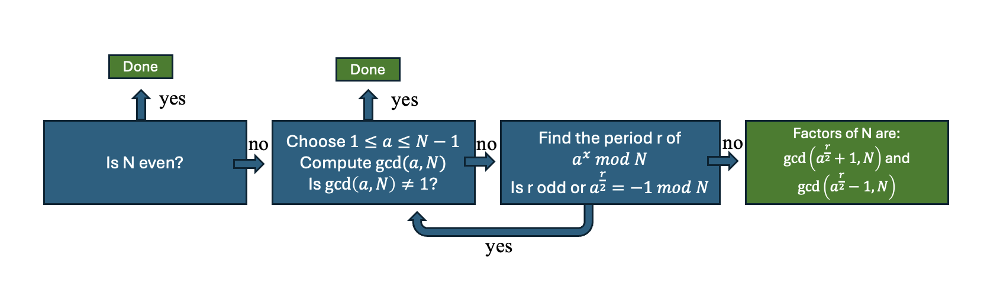

# Chapter 5: Shor's Algorithm:

Shor's algorithm is probably one of the most famous quantum algorithms, and the reason for interest of various militaries around the world in quantum computing. It is connected to RSA encryption, which basically is the foundation of the internet privacy as we know it. Breaking it, would have huge implications on everything we do. Breaking RSA can be reduced to factoring large numbers.

## 5.1 Introduction:

**Problem:** Given an integer $N$, output a factor $1 < K < N$. with any chosen constant level of probability $(1-\epsilon)$, and the algorithm will run in polynomial time $O(n^3)$.

## 5.2. Factoring as a periodicity problem:

The approach we will take is to transform the factoring problem into a periodicity problem. And then we will show that we can solve the periodicity problem efficiently with a quantum algorithm.

**Theorem**: (_Euler's theorem_) If $a$ and $N$ are coprime, then there is a least power $1<r<N$ such that $a^r\equiv 1 \pmod{N}$. This $r$ is called the order of $a$ mod $N$.

Using Euler's theorem we can show that $f(k) = a^k \pmod{N}$ is periodic with period $r$. This is because 

$$
f(k + r) = a^{k+r} \pmod{N} = a^k a^r \pmod{N} = a^k \pmod{N} = f(k)
$$

Suppose that we find the period $r$ of $f(k)$ and this period $r$ is even. Then we can re-write our original statement as:

$$
a^r - 1 = (a^{r/2} - 1)(a^{r/2} + 1) \equiv 0 \pmod{N}
$$

$N$ does not divide $a^{r/2} - 1$, therefore $N$ must either (a) divide $a^{r/2} + 1$ or (b) partly divide into $a^{r/2} + 1$ and partly into $a^{r/2} - 1$. If it partly divides into $a^{r/2} + 1$, we can use classically efficient euclids algorithm $gcd(a^{r/2} + 1, N)$ to find a non-trivial factor of $N$. Therefore, if we pick $a$ at random then, assuming $r$ is even and $a^{r/2}+1$ is not divisible by $N$, we can classically find a non-trivial factor of $N$.

**Theorem**: Suppose $N$ is odd and not a power of a prime. If $a<N$ is chosen uniformly at random with $gcd(a,N)=1$ then $Prob(\text{r is even and } a^{r/2}\not\equiv -1 \pmod{N})$ is at least $1/2$.

## 5.3. Algorithm:

1. Is N even? If so, output 2 and stop
2. Choose $a$ at random from 1 to $N-1$ and compute $gcd(a,N)$. If $gcd(a,N) \neq 1$ then we are done.
3. If s=1 find the period r of the sequence $a^k \pmod{N}$. If r is odd or $a^{r/2} \equiv -1 \pmod{N}$, then go back to step 2.
4. Otherwise $gcd(a^{r/2} + 1, N)$ and $gcd(a^{r/2} - 1, N)$ are non-trivial factors of $N$.

As you can see already here, everything about solving this problem boils down to the efficient implementation of fidning the period of r of $a^x \pmod{N}$. Following section will show how can we do it efficiently with a quantum algorithm.

## 5.4. Efficient implementation of period finding of $a^k \pmod{N}$:

In the end what we need to do is to find the period $r$ of the sequence $a^k \pmod{N}$. The circuit should be the same as the one for period finding algorithm. What we want to show is that each block of this circuit can be implemented efficiently.

We have already shown that the QFT can be implemented efficiently in terms of query complexity. If we want to know whether the algorithm can be efficient in terms of time-complexity, we need to consider how we can implement the bit oracle $O_f$ efficiently. Efficient oracle $O_f$ is equivalent to efficient implementation of $f(k) = a^k \pmod{N}$.

### 5.4.1. Efficient implementation of $f(x) = a^x \pmod{N}$:

Using binary representation of $x$ we can write:

$$
x=x_{m-1} \cdot 2^{m-1}+x_{m-2} \cdot 2^{m-2}+\ldots+x_0
$$

therefore

$$
a^x\pmod{N}=\left(a^{2^{m-1}}\right)^{x_{m-1}}\left(a^{2^{m-2}}\right)^{x_{m-2}} \ldots(a)^{x_0}\pmod{N}
$$

, and as each $x_i$ is either 0 or 1, therefore we will be either multiplying or not the result of the previous step by $a^{2^i}$. We can implement it as a multiplication by $a^{2^i}$ controlled on the qubit $x_i$. This is equivalent to the following circuit:

Therefore if we prepare the first register in the state $\sum_{x=0}^{N-1} \left|x\right>$, and the second register in the state $\left|1\right>$, then we will end up with the state after applicaion for the circuit above:

$$
\sum_{x=0}^{N-1} \left|x\right>\left|1\right> \rightarrow \sum_{x=0}^{N-1} \left|x\right> \left|a^x \bmod{N}\right>
$$

**Comment**:

Maybe an interesting thing to note is that we between two steps of the algorithm we can re-use the previous multiplication to compute the next power of $a$. This is because we can write it recursively as, and so it only needs to be squared:

$$
a^{2^j} \pmod{N} = \left(a^{2^{j-1}}\right)^2 \pmod{N}
$$

This somewhat means that we can reuse the result of the previous computation to compute the next power of $a$. This means that 

