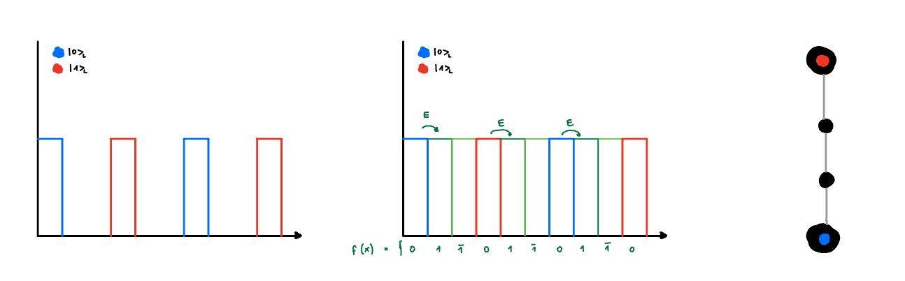
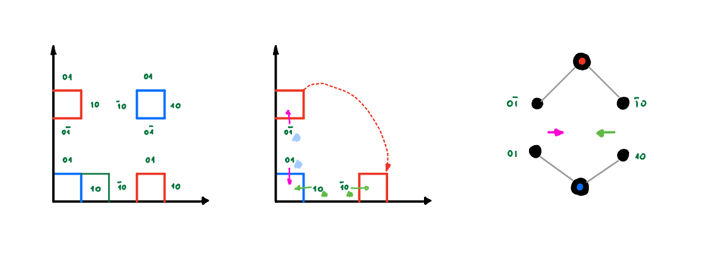
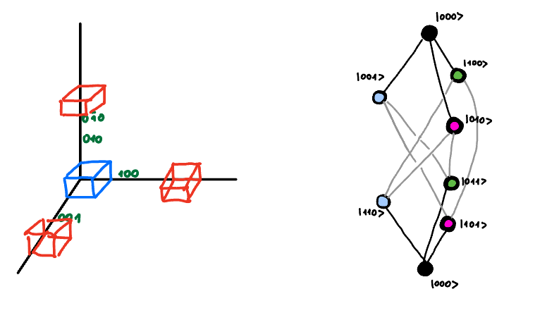
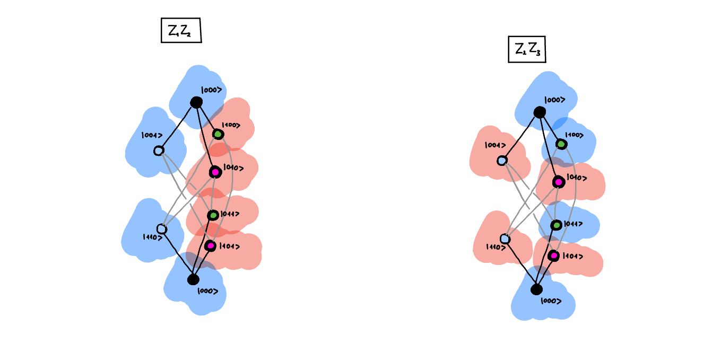

# Chapter 7: Quantum Error Correction:

At this moment we are far from reliable quantum hardware. Any quantum state that we engineer is very fragile if left alone, and even more fragile when we perform any operations on it. The fragility of things is not so distant to our understanding and we can easily comprehend that if we deal with something fragile, we better should create few copies of it, and somehow use this redundancy to our advantage. 

For quantum world this is even more important, as we store information in the superposition of quantum states. This means that any disturbance to any qubit hurts us even more. This is because it equally affects all the superpositioned states. And if we use some sort of interference for our algorithms we are screwed, because it will be even more affected. 

Therefore we need to understand both the nature of errors, and think about the strategies to protect our quantum information from them. As mentioned above already a strategy of creating a redundancy could be helpful. In this chapter we will explore those redundancies. It is important to note that somewhat in quantum world we need to be careful with the measurements on the redundant systems, as they might collapse the superposition. So we need to take a special care of that and perform only the measurements that can tell us about the errors, but simultaneously leave the logical information unchanged. 

## 7.1. The Three Qubit Bit Flip Code:

## 7.2. Even tiny error is massive:

## 7.3. Size of the code:

## 7.4. Knill-Laflamme condition:

iff 

$$
\left<1\right|_L E_b^\dagger E_a \left|0\right>_L \neq 0 
$$

then no measurement can decide with certainty whether the initial state was $\left|0\right>_L$ or $\left|1\right>_L$.