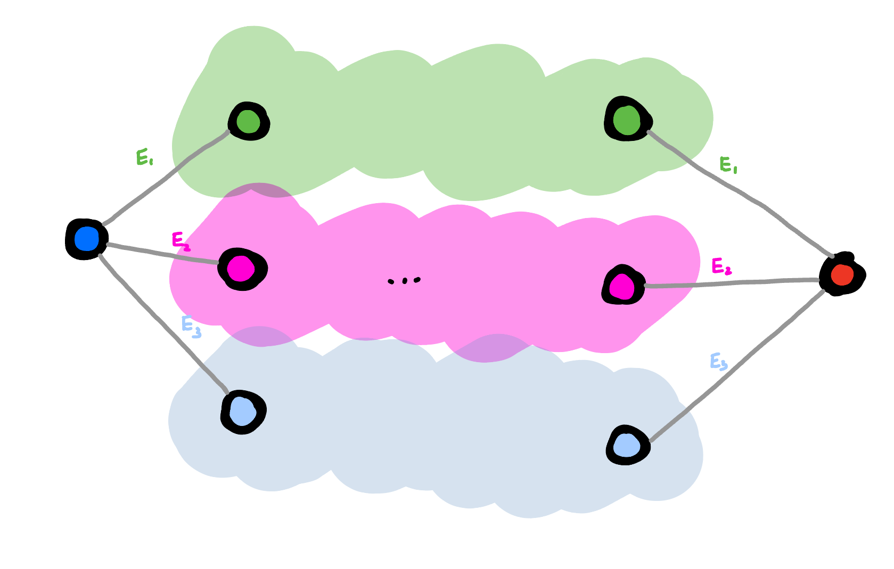

# Chapter 7: Quantum Error Correction:

At this moment we are far from reliable quantum hardware. Any quantum state that we engineer is very fragile if left alone, and even more fragile when we perform any operations on it. The fragility of things is not so distant to our understanding and we can easily comprehend it. If we deal with something fragile, we better should work with a few copies of it(in case one of them breakes). This somehow points to using a redundancy. 

For quantum world this is even more important, as we store information in the superposition of quantum states. This means that any disturbance to any qubit hurts us even more. This is because it equally affects all the superpositioned states. And if we use some sort of interference for our algorithms we are screwed, because it will be even more affected. 

Therefore we need to understand both the nature of errors, and think about the strategies to protect our quantum information from them. As mentioned above already a strategy of creating a redundancy could be helpful. In this chapter we will explore those redundancies. It is important to note that somewhat in quantum world we need to be careful with the measurements on the redundant systems, as they might collapse the superposition. So we need to take a special care of that and perform only the measurements that can tell us about the errors, but simultaneously leave the logical information unchanged. 

In this write-up I want first to introduce the intuition behind error correction and only then introduce the mathematical formalism.

## 7.0. Redundancy for qubits:

Let's first consider what does it mean that our qubit is encoded in a redundant space. Consider a space with 4 distinct states. If we want to encode a binary information, then we have too many states than we need. But let's consider the following situation, which is illustrated on the diagram below. We have 4-distinct states and some errors that move us from one state to another. This errors can be arbitrary, but in our case we consider that they only can follow the grey lines.

On the diagram above you can see 4 black dots, each corresponding to a distinct state. Those dots are connected to each other by grey lines, which stand for the errors that can act on our system. This means that if we did encode the information in the 0(blue) and 3(red) states, then a single error would not be able to change the information from blue to red. It would only move us either to a state 1 or 2. In fact we could even find out where did this error come from, which means that we haven't lost any information due to this error. We could find out which error occured simply by assuming the state must have been in the blue or red state, and now by measuring whether it is in 1, or 2 we can tell which error occured. However, this would be bad, as this would tell us also the logical information, and collapse the superposition. 

Instead consider that the error $E_3 = E_1$. In this situation performing a measurement to determine whether we are in a subspace span by states {0, 3} or {1, 2} would tell us whether the error $E_3 = E_1$ occured without revealing any logical information. This is helpful as then we can simply perform the operation that reverses the error $E_3 = E_1$ to bring us back to the original state. If we keep doing it repeatedly, we can contineously allow the system to stay in the blue and red states that carry the information. The aspect of being able to measure whether the error happened without learning anything about the logical information will be discussed later.

### 7.0.1. Knill-Laflamme condition constraints the separation:

Seeing the space of states and how the errors act on it allow us to understand whether we will be able to correct the errors or not. Consider following example:

In this example the error $E_1$ moves the state from 0 to 1, and the error $E_2$ moves the state from 2 to 1. In this case if error occured, we cannot tell whether it was $E_1$ or $E_2$ that happened. This means that we cannot correct the error.

This example can be more formally stated as the Knill-Laflamme condition. Which states that for the errors to be distinguishable, the following condition should be met:

$$
{ }_L\left< j\right| E_b^{\dagger} E_a\left|i\right>_L= \delta_{ab}\delta_{ij}
$$

If this condition is met, it means we can distinguish between the errors, and so we are able to correct them. The Knill-Laflamme condition is a necessary and sufficient condition for the errors to be corrected.

What it means as well is that if we prepared any state in the logical space of $\left|\psi\right>_L = \alpha\left|0\right>_L + \beta\left|1\right>_L$, then the error followed by the error measurement and correction should not affect both $\alpha$ and $\beta$. If Knill-Laflamme condition isn't met, then we can see how alpha and beta will be mixed together.

Whils't thinking diagrametically about both cases, we can see that the Knill-Laflamme condition is met in the first case and not met in the second one. What is different about those two is that in order for the K-L condition to be met logical 0 (blue) cannot be connected to a state, to which logical 1 (red) is connected. 

### 7.0.2. How large Hilbert space do we need to correct for errors:

So then the natural next question comes to mind. How many nodes of separation do we need to correct for errors? If we want to be able to correct for states where only single error happened, then we need to have at least two nodes of separation. 

In order to have this larger Hilbert space, we either need to have more qubits or use qudits. Consider that the only error channel that we need to consider is a bit flip channel. In this case if we use $n$ qubits to encode a logical state, then we have n possible non-logical qubit states into which each one of our logical states can.

So for logical state composed of 1 qubit, the logical state is connected only to one other state. For logical state composed of 2 qubits, the logical state is connected to 2 other states. And so on. We know equally that the necessary size of the vector space to be able to correct for all errors is such that the distance between any two logical states is at least 2. Therefore for $n$ qubits with bit-flip errors we need at least $2n+2$ states to be able to correct for all errors. Necessary graphs for different values of $n$ are shown below.

We straight away can notice that for $n=1$ we need 4 states to be able to correct for all errors, but the hilbert space of single qubit is only 2-dimensional. This means that it would be impossible to correct for errors in this case. We could try to use $n=2$ qubits, but we will run into similar problem. We need 6 states to be able to correct for all errors, but the hilbert space of 2-qubit is only 4-dimensional. Going further we can see that for $n=3$ we need 8 states to be able to correct for all errors, and the Hilbert space of 3-qubit is 8-dimensional. This means that we can correct for errors in this case. Code that does that, is called 3-qubit bit-flip code, and will be described below. 

By analogy we can try to understand how large Hilbert space do we need if each physical qubit comes with a bit-flip and phase-flip error. This means that for logical state composed of $n$ qubits we need to have $2\left(2n\right)+2$ states to be able to correct for all errors. We can do a similar analysis as above and see that $2^n \geq 2\left(2n\right)+2$ for n=5. This is exactly the smallest code size that can correct for both bit-flip and phase-flip errors. The analysis is done below:

### 7.0.3. See without seeing:

As mentioned already before, quantum error correction is somewhat more subtle than what we sofar described. Yes we want to know in which state we are to know which error occured, but at the same time we don't want to learn anything about the logical information. If we did, we would simply collapse the superposition into one of the measurement outcomes, and we would loose the quantum information. 

To do this we can for instance instead of measuring the exact state in which the qubit are, we can pair this state up with some other state that was caused by the same type of error (but is due to this error occuring on a different logical state). This way we can measure which error occured without learning anything about the logical information.

This is illustrated on the diagram below:

What we see is two logical states which are each connected to three other states, that are due to the errors $E_1$, $E_2$, and $E_3$. I now grouped the states from two logical subspaces together if they were caused by the same type of error. We can measure whether the states belong to this group. If they do, they must have been caused by error $E_i$, and so we know how can we bring them back to the original logical state. Because we now measure whether we are in a subspace, of which states from both logical subspaces are part of, we can't learn anything about the logical information, and so we learn about the error without collapsing the superposition. The requirement for it is that the errors act in the same way on both logical states.

### 7.0.4. Even tiny error is massive when measured:

One thing I was initially confused about is why the errors that we consider are always so massive. It seems that we are always considering the errors that for instance flip entirely the phase or the bit, or like ilustrated above move us from one state in our vector space to another. But can't I have just a tiny error, where I am rotating slightly from state i to state j?

Yes, of course you can! However, in quantum mechanics it will look like a jump if you measure it:

$$
\left|\psi\right> \rightarrow \left|\psi\right> + \epsilon\left|\psi'\right>
$$

For instance we can take a tiny bit-flip error on the first qubit acting on the state $\left|000\right>$:

$$
\left|000\right> \rightarrow \left|000\right> + \epsilon\left|100\right>
$$

And now what we can see is that actually when we make a measurement as described in the chapter 7.0.3, we will always collapse our state into either $\left|000\right>$ or $\left|100\right>$. This means that any small rotation, or tiny tiny error will always be transformed into either a bit-flip or no error at all. This is nice because it means that each error is very visible and we can correct for it.

## 7.1. The Three Qubit Bit Flip Code:

Given that we undestood some basic concepts of error correction, let's now look at the first example of error correction. The 3-qubit bit-flip code. This should formalize the concepts that we have discussed sofar.

As we said encoding information simply in a single physical qubit $\left|\psi\right> = \alpha\left|0\right> + \beta\left|1\right>$ is not a good idea, as any error will be catastrophic. Let's consider that the only error that can happen is a bit-flip error. In this case the error flipping the bit would cause the $E \left|\psi\right> = E\left(\alpha\left|0\right> + \beta\left|1\right>\right) = \alpha\left|1\right> + \beta\left|0\right>$.

As discussed above if we want to correct for single errors per qubit, then we need at least 3 qubits to be able to correct for all errors. Let's then encode the information in a 3-qubit code, where $\left|\psi\right>_L = \alpha\left|0\right>_L + \beta\left|1\right>_L$, and where $\left|0\right>_L = \left|000\right>$ and $\left|1\right>_L = \left|111\right>$. We can construct this code by having information encoded in the first qubit, and then performing two CNOT operations controlled on the first qubit and applied to the second and third qubits. 

In this case there are 3 possible errors that can happen, which correspond to the bit-flip errors on each of the qubits. We can represent this on the diagram below:

And as you can see the all possible errors are distinguishable as neither of the states is connected to the two logical states via some error channel. To correct for the error we would like to distinguish whether we are in black, green, pink or blue subspace. Notice that even if we know in which of those subspaces we are, it doesn't reveal us any information about the logical information.

How can we measure in which subspace we are. Well, there are four states, so it should be enough to make $\log_2\left(4\right) = 2$ measurements. We can do through measuring $Z_1Z_2$ and $Z_2Z_3$ and then we can see in which subspace we are. In the diagram below I have illustrated the measurement. The blue color tells us that we would measure positive value for this measurement, and the red color tells us that we would measure negative value for this measurement.

As both of those measurements slice the space differently, by knowing the outcomes of both measurements we can tell in which subspace we are. This means that we know exactly which error occured, and so we can correct for it.

The logical operators that would measure the logical qubit would have the following form: 

$$
X_L = X_1X_2X_3
$$

$$
Z_L = Z_1Z_2Z_3
$$

Mathematically what we require from the error syndrome measurement is that the error syndrome measurement should commute with the logical operators. If they did not, they would consequently reveal information about the logical state, and so destroy the coherence of the logical state.

We can see that:

$$
\left[Z_L, Z_1Z_2\right] = \left[Z_L, Z_2Z_3\right] = \left[X_L, Z_1Z_2\right] = \left[X_L, Z_2Z_3\right] = 0
$$

which aggrees with out already formed intuition.

Additionally I am including here a table of all possible errors and their corresponding error syndrome measurements, and the error correction operations.

| Error    | Syndrome s $\left(Z_1Z_2, Z_2Z_3\right)$ | Correction $U_s$ |
|----------|----------------------------------|--------------------|
| $\left(I I I\right)$ | $\left(0, 0\right)$                              | $\left(I I I\right)$          |
| $\left(X I I\right)$ | $\left(1, 0\right)$                              | $\left(X I I\right)$          |
| $\left(I X I\right)$ | $\left(1, 1\right)$                              | $\left(I X I\right)$          |
| $\left(I I X\right)$ | $\left(0, 1\right)$                              | $\left(I I X\right)$          |

The circuit to measure the error syndrome is shown below:

I wont go into other codes here, as it would be useful to first introduce the concept of stabilizer formalism, and then we will have much more compact notation for the codes.

## 7.2. Knill-Laflamme condition:

The actual Knill-Laflamme condition can be written actually as a necessary and sufficient condition:

$$
\left< j\right| E_b^{\dagger} E_a\left|i\right>_L = c_{ab}\delta_{ij}
$$

This is a necessary and sufficient condition for the errors to be corrected. And how do we reconcile this with the intuition that we have developed sofar. What happens when two errors bring us to the same state or bring us a bit to the same state? Well this is simply because we poorly defined our basis states. If we were to define our basis states better, we would be able to distinguish between those errors. So given that we have our matrix $c_{ab}$ we can always find a better basis, where the $c_ab$ will be diagonal, and so will have the form:

$$
\left< j\right| E_b^{\dagger} E_a\left|i\right>_L = \delta_{ab}\delta_{ij}
$$

or similar. 

