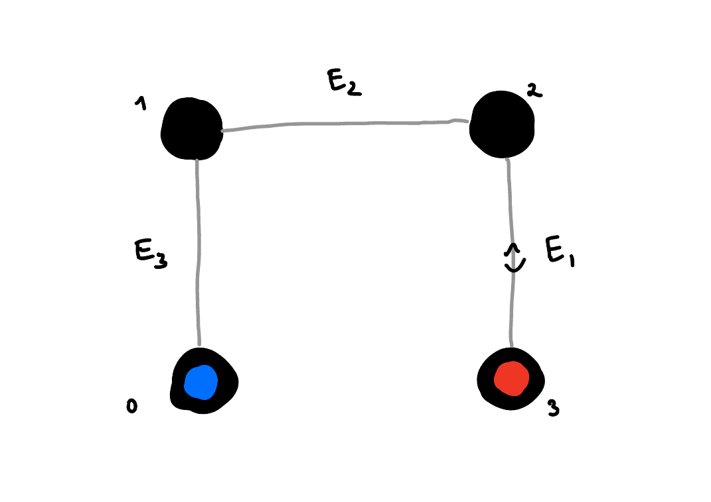
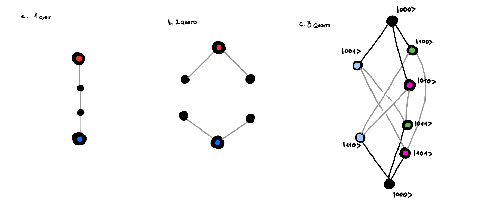

# Chapter 7: Quantum Error Correction:

At this moment we are far from reliable quantum hardware. Any quantum state that we engineer is very fragile if left alone, and even more fragile when we perform any operations on it. The fragility of things is not so distant to our understanding and we can easily comprehend. If we deal with something fragile, we better should work with a few copies of it(in case one of them breakes). This somehow points to using a redundancy. 

For quantum world this is even more important, as we store information in the superposition of quantum states. This means that any disturbance to any qubit hurts us even more. This is because it equally affects all the superpositioned states. And if we use some sort of interference for our algorithms we are screwed, because it will be even more affected. 

Therefore we need to understand both the nature of errors, and think about the strategies to protect our quantum information from them. As mentioned above already a strategy of creating a redundancy could be helpful. In this chapter we will explore those redundancies. It is important to note that somewhat in quantum world we need to be careful with the measurements on the redundant systems, as they might collapse the superposition. So we need to take a special care of that and perform only the measurements that can tell us about the errors, but simultaneously leave the logical information unchanged. 

In this write-up I want first to introduce the intuition behind error correction and only then introduce the mathematical formalism.

## 7.0. Redundancy for qubits:

Let's first consider what does it mean that our qubit is encoded in a redundant space. Consider a space with 4 distinct states. If we want to encode a binary information, then we have too many states than we need. But let's consider the following situation, which is illustrated on the diagram below. We have 4-distinct states and some errors that move us from one state to another. This errors can be arbitrary, but in our case we consider that they only can follow the grey lines.

On the diagram above you can see 4 black dots, each corresponding to a distinct state. Those dots are connected to each other by grey lines, which stand for the errors that can act on our system. This means that if we did encode the information in the 0(blue) and 3(red) states, then a single error would not be able to change the information from blue to red. In fact we could even find out where did this error come from, which means that we haven't lost any information due to this error. However if the second error happened then we couldn't distinguish anymore what was the initial state. Therefore we need to do some sort of active error correction. What it means is that we should keep measuring the states of the system to learn whether an error happened, and if it did, then we should reverse it. By doing this we can contineously allow the system to stay in the blue and red states that carry the information. This is nice. The aspect of being able to measure whether the error happened without learning anything about the logical information will be discussed later.

### 7.0.1. Knill-Laflamme condition constraints the separation:

Seeing the space of states and how the errors act on it allow us to understand whether we will be able to correct the errors or not. Consider following example:

In this example the error $E_1$ moves the state from 0 to 1, and the error $E_2$ moves the state from 2 to 1. In this case if error occured, we cannot tell whether it was $E_1$ or $E_2$ that happened. This means that we cannot correct the error.

This example can be more formally stated as the Knill-Laflamme condition. Which states that for the errors to be distinguishable, the following condition should be met:

$$
{ }_L\left< j\right| E_b^{\dagger} E_a\left|i\right>_L=0 \quad \forall a, b \text { and } i \neq j
$$

If this condition is met, it means we can distinguish between the errors, and so we are able to correct them. The Knill-Laflamme condition is a necessary and sufficient condition for the errors to be corrected.

What it means as well is that if we prepared any state in the logical space of $\left|\psi\right>_L = \alpha\left|0\right>_L + \beta\left|1\right>_L$, then the error followed by the error measurement and correction should not affect both $\alpha$ and $\beta$. If Knill-Laflamme condition isn't met, then we can see how alpha and beta will be mixed together.

Whils't thinking diagrametically about both cases, we can see that the Knill-Laflamme condition is met in the first case and not met in the second one. What is different about those two is that in order for the K-L condition to be met logical 0 (blue) cannot be connected to a state, to which logical 1 (red) is connected. 

### 7.0.2. How large Hilbert space do we need to correct for errors:

So then the natural next question comes to mind. How many nodes of separation do we need to correct for errors? If we want to be able to correct for states where only single error happened, then we need to have at least two nodes of separation. 

In order to have this larger hilbert space, we either need to have more qubits or use qudits. Consider that the only error channel that we need to consider is a bit flip channel. In this case if we use $n$ qubits to encode a logical state, then we have n possible non-logical qubit states into which each one of our 

## 7.1. The Three Qubit Bit Flip Code:

## 7.2. Even tiny error is massive:

## 7.3. Size of the code:

## 7.4. Knill-Laflamme condition:

iff 

$$
\left<1\right|_L E_b^\dagger E_a \left|0\right>_L \neq 0 
$$

then no measurement can decide with certainty whether the initial state was $\left|0\right>_L$ or $\left|1\right>_L$.