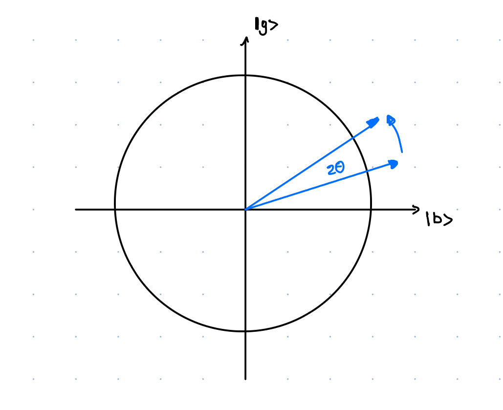

# Chapter 4b: Grover's Style Algorithms:

## 4.2. Grover's algorithm:

[Grover's paper](https://arxiv.org/pdf/quant-ph/9605043)

**Problem - Unstructured search**: Given an access to a computable function $f(x) : \{0,1\}^n \rightarrow \{0,1\}$ we want to find some $x$ such that $f(x_0) = 1$, for a unique 'marked' element $x_0\in\{1,...,N\}$.

Grover's algorithm is an algorithm which has a large range of applications and is a beautiful example of how quantum mechanics allows us to speed up many problems. But, in words of Scott Aaronson,  the speed up is rather modest, as it is only quadratic. 

Consider above problem in the classical setting. On average one would have to query $N/2$ elements to find the marked one, which means that the average time complexity is $O(N)$. In contrast, quantum algorithm will be able to find the marked element in $O(\sqrt{N})$ time. In the chapter below we will try to see how it is achieved.

### Algorithm:

This circuit corresponds to:
1. Applying $\left(-H^{\otimes n} U_0 H^{\otimes n} U_f\right)^{N_{\text {optimal }}} H^{\otimes n} \left|0\right>^{\otimes n}$
2. Measuring the resulting state

### Why it works?:
I would like to present here two geometric explanations why Grover's algorithm works. I would recommend you to think about both of them, as both of them allow you to understand different things about the algorithm. Explanation 2 is the standard one and is probably a way how to think about Grover's algorithm. However I think that when Grover was trying to come up with the algorithm he was thinking about Explanation 1, which then led to Explanation 2. You will see this smooth transition in the explanation (and not so smooth transition in my writing :) ).

#### Explanation 1: Amplitude amplification:

**Definitions**:

Before we start with the explanation, let's re-write the operators in Grover's algorithm in a slightly different way. 

- Lets define good and bad states as:
  - $\left|g\right> = \left|x_0\right>$
  - $\left|b\right> = \frac{1}{\sqrt{N-1}} \sum_{x\neq x_0} \left|x\right> = \frac{\sqrt{N}}{\sqrt{N-1}}\left|+\right> - \frac{1}{\sqrt{N-1}} \left|g\right>$
- And let's define plus and minus states as:
  - $\left|+\right> = \frac{1}{\sqrt{N}} \sum_x \left|x\right> = H^{\otimes n} \left|0\right>^{\otimes n} = \frac{1}{\sqrt{N}}\left|g\right> + \frac{\sqrt{N-1}}{\sqrt{N}}\left|b\right>$
  - $\left|-\right> = - \frac{1}{\sqrt{N}}\left|g\right> + \frac{\sqrt{N-1}}{\sqrt{N}}\left|b\right>$
- $U_f$ is just a phase oracle, which flips the phase of the marked element. We can rewrite it as $U_f = I - 2 \left|x_0\right>\left<x_0\right|$
- $U_0$ flips the phase of the $\left|0\right>^{\otimes n}$ state. This means that $H^{\otimes n} U_0 H^{\otimes n} = H^{\otimes n} \left(I - 2 \left|0\right>\left<0\right|^{\otimes n}\right) H^{\otimes n} = I - 2 \left|+\right>\left<+\right|$

Therefore the circuit can be re-writen as:

$$
\left(-\underbrace{\left(I - 2\left|+\right>\left<+\right|\right)}_{H^{\otimes n} U_0 H^{\otimes n}}\underbrace{\left(I - 2\left|g\right>\left<g\right|\right)}_{U_f}\right)^{N_{\text {optimal }}} \left|+\right>
$$

**Action of the operator on the plus state**:

Let's consider then the action of the operator on the plus state $\left|+\right>$:

$$
\begin{aligned}
-\left(I - 2\left|+\right>\left<+\right|\right)\left(I - 2\left|g\right>\left<g\right|\right)\left|+\right> 
&= -\left(I - 2\left|+\right>\left<+\right|\right)\left(\left|+\right> - \frac{2}{\sqrt{N}}\left|g\right>\right) 
\\&= -\left(\left|+\right> - \frac{2}{\sqrt{N}}\left|g\right> - 2\left|+\right> + \frac{4}{N} \left|+\right>\right) 
\\&= \left(\left(1 - \frac{4}{N}\right)\left|+\right> + \frac{2}{\sqrt{N}}\left|g\right>\right)
\end{aligned}
$$

This can be visualised as:

We can see how each step of the algorithm has a specific purpose. 
- $U_f$ is an operation that flips the phase of the target state. 
- $H^{\otimes n} U_0 H^{\otimes n}$ when applied to $\left|\psi\right>$ performs interference between the wavefunction $\left|\psi\right>$ and $-2\left|+\right>\left<+|\psi\right>$, effectively shifting the whole wavefunction down by $2\left|+\right>\left<+|\psi\right>$.
- Minus sign inverts the amplitude of the wavefunction, and is done only for convenience of thinking about the algorithm, but has no real purpose. 

**Can one infinitely amplify the amplitude?**:

Seeing how does Grover's step affect the $\left|+\right>$ state, we can see that the amplitude of the $\left|+\right>$ state is attenuated by a factor of $\left(1 - \frac{4}{N}\right)$. One could then get hopefull and think that we should just apply the Grover's step enough times to get rid of the amplitude completely. This is, however, not the case. One can spot now the problem with Grover's algorithm. The approach only works when the phase of marked element is the same as the phase of non-marked elements:

Then instead of the amplitude amplification we will get amplitude destruction. Will it ever occur? Yes it will! If we keep going with the algorithm for too long then we will first attenuate the amplitude of the $\left|+\right>$ state to zero, but we will not always decrease the amplitude of the bad state. Some amount of the amplitude in the good state $\left|g\right>$ will contribute to the shift introducted by $H^{\otimes n} U_0 H^{\otimes n}$, introducing shift of $2\left<+|\psi\right>$. This will cause eventual overshoot and we will end up in the phase of the bad state being opposite to the phase of the good state. This will continue in a cycle.

**Grover's step for a general state $\left|\psi\right>$**:

Consider now the general case. Starting with the state: $\left|\psi\right> = \alpha\left|g\right> + \beta\left|b\right>$. Lets write it in a vector form:
- $\left|\psi\right> = \begin{pmatrix}\alpha \\ \beta\end{pmatrix}$
- $U_f = \begin{pmatrix}-1 & 0 \\0 & 1\end{pmatrix}$
- $U_0 = \begin{pmatrix}\cos\theta & \sin\theta \\-\sin\theta & \cos\theta\end{pmatrix} \begin{pmatrix}-1 & 0 \\0 & 1\end{pmatrix} \begin{pmatrix}\cos\theta & -\sin\theta \\\sin\theta & \cos\theta\end{pmatrix}$

, where $\cos\theta = \sqrt{\frac{1}{N}}$ and $\sin\theta = \sqrt{\frac{N-1}{N}}$.

Then the Grover's step is:

$$
\begin{aligned}
- H^{\otimes n} U_0 H^{\otimes n} U_f \left|\psi\right> &= 
\begin{pmatrix}
-1 & 0 \\
0 & -1
\end{pmatrix}
\begin{pmatrix}
\cos\theta & \sin\theta \\
-\sin\theta & \cos\theta
\end{pmatrix}
\begin{pmatrix}
1 & 0 \\
0 & -1
\end{pmatrix}
\begin{pmatrix}
\cos\theta & -\sin\theta \\
\sin\theta & \cos\theta
\end{pmatrix}
\begin{pmatrix}
-1 & 0 \\
0 & 1
\end{pmatrix}
\begin{pmatrix}
\alpha \\
\beta
\end{pmatrix}
\\ &=
\begin{pmatrix}
\cos 2\theta & \sin 2\theta \\
-\sin 2\theta & \cos 2\theta
\end{pmatrix}
\begin{pmatrix}
\alpha \\
\beta
\end{pmatrix}
\end{aligned}
$$

One can then imidietely see that attenuation of the amplitude of the bad state after Grover's step is $\beta' = \beta \cos 2\theta - \alpha \sin 2\theta$. This means that the amplitude of the good state and the bad state contribute with an opposite sign to the ampltiude of the bad state after Grover's step.

This can be then visualised as rotation of the state $\left|\psi\right>$ around the $\left|+\right>$ state by an angle of $2\theta$ in anti-clockwise direction.

Why is then the complexity of the algorithm $O(\sqrt{N})$? Well to get from a bad state to a good state we need to rotate the state by an angle of $\pi/2$. This means that we need to rotate $\frac{\pi/2}{2\theta}$ times. As $\theta \approx \sin \theta = \sqrt{\frac{1}{N}}$ we get that we need to rotate $\frac{\pi/2}{2\sqrt{\frac{1}{N}}} = \frac{\pi}{4}\sqrt{N}$ times. This gives $O(\sqrt{N})$ iterations.

#### Explanation 2: Rotations around 2D-plane:

not finished