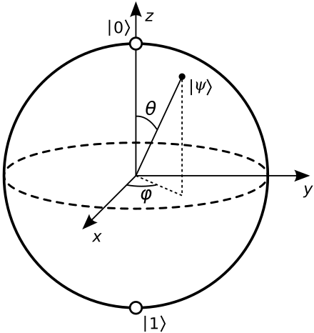
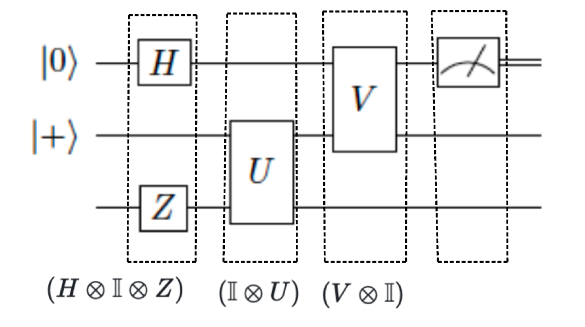

# Chapter 1b: Usefull Toolbox

## 1.6. Bloch Sphere:
- _Bloch Sphere_ is just a common representation of a two level system, which allows one to think about the states and operations in a more intuitive way
- Normally when one thinks about how many parameters one needs to define a two level system, they can naively consider 4 degrees of freedom. In the end two level system lives in $\left|\psi\right> \in \mathbb{C}^2$. In different words, any _pure state_ can be written as a superposition of the basis vectors $\left|0\right>$ and $\left|1\right>$, where the coefficient of each of the two basis vectors is a complex number. $\left|\psi\right> = a_1e^{i\theta_1} \left|0\right> +  a_2e^{i\theta_2} \left|1\right>$. 4-parameters right?
    - We know, however, that the norm of a _pure state_ must equal to 1, which means that $\left<\psi|\psi\right> = 1 $, and so $\left|a_1\right|^2 + \left|a_2\right|^2=1$. This reduces the number of free parameters to 3
    - We also know that we dont care about the global phase of a state, as it doesn't change anything about our measurement, and so we can also neglect one degree of freedom, which reduces the number of free parameters to 2
    - This means that we can represent any 2-level quantum pure state on a two dimensional manifold (which is easy to think about). More specifically we care about two things (a) the relative phase between the two basis vector, and (b) the relative projections (populations) onto two basis vectors. We can use the angle around the circle to define the relative phase, and we can use the distance from the center of the circle to define the relative projections. This is the Bloch Sphere.
- How does one parametrise something on a unit-sphere?
    - One can do it with angles, $\theta \text{ and } \phi$
    - $\left|\psi\right> = \cos\frac{\theta}{2} \left|0\right> +  e^{i\phi}\sin{\frac{\theta}{2}} \left|1\right>$
    - In such representation the probability of measuring state $\left|0\right>$ is: $\left<0|\psi\right> = \cos^2\frac{\theta}{2}$, and to measure state $\left|1\right>$ is $\sin^2\frac{\theta}{2}$
    - $\left|\psi\right>$ can be represented on a unit sphere as:

- Any Unitary Operator then will be some sort of rotation of this state, mapping it from one point on this sphere to another point on this sphere - you will see it in the subchapter Quantum Circuits

## 1.7. Bell Basis
- Let $\mathcal{H}_{A B}=\mathcal{H}_A \otimes \mathcal{H}_B \cong \mathbb{C}^4$ be the bipartite Hilbert space of two qubits and consider the product basis of the computational bases of the qubit subsystems. For $\mathcal{H_{AB}}$ there exists a basis consisting of _maximally entangled states_ denotes as:

$$\begin{array}{ll}\left|\psi^{00}\right>=\frac{1}{\sqrt{2}}(\left|00\right>+\left|11\right>) & =\left|\Phi^{+}\right> \\ \left|\psi^{01}\right>=\frac{1}{\sqrt{2}}(\left|00\right>-\left|11\right>) & =\left|\Phi^{-}\right> \\ \left|\psi^{10}\right>=\frac{1}{\sqrt{2}}(\left|01\right>+\left|10\right>) & =\left|\Psi^{+}\right> \\ \left|\psi^{11}\right>=\frac{1}{\sqrt{2}}(\left|01\right>-\left|10\right>) & =\left|\Psi^{-}\right>\end{array}$$

- The first number stands for parity, the second number stands for phase. $\left|\psi^{10}\right>$ has parity 1 (odd number of 1's), and relative phase $(-1)^0=1$
- The maximally entangled states are locally convertible - there exist local operations on the subsystem B that transforms one Bell state into another Bell state.
$$\left|\psi^{i j}\right>=\left(\mathbb{I}_A \otimes X_B^i Z_B^j\right)\left|\psi^{00}\right>$$

## 1.8. Quantum Circuits
**Example Quantum circuit**

 

corresponds to unitary operator $\left(V \otimes \mathbb{I}\right)\left(\mathbb{I}\otimes U\right)\left(H\otimes\mathbb{I}\otimes Z\right)$ applied to three qubits followed by a Z-measurement of the first qubit

**Common Gates**

 

- Haddamard Gate:
    - $H=\frac{1}{\sqrt{2}}\left(\begin{array}{cc}1 & 1 \\ 1 & -1\end{array}\right)=\left|+\right>\left< 0\right|+\left|-\right> \left<1\right|=\left| 0\right>\left<+\right|+\left| 1\right>\left<-\right|$
    - As an orthogonal transformation in the real Euclidean plane $\mathbb{R}^2$, H is reflection in the mirror line at angle $\frac{\pi}{8}$ to the x-axis
- X, Y, Z:
    - $X = \left(\begin{array}{ll} 0 & 1 \\ 1 & 0 \end{array}\right)$, $Z = \left(\begin{array}{ll} 1 & 0 \\ 0 & -1 \end{array}\right)$, $Y = \left(\begin{array}{ll} 0 & 1 \\ -1 & 0 \end{array}\right)$
- Controlled-U Gate:
    - $\mathrm{C} U=\left|0\right>\left<0\right|\otimes \mathrm{id}+\left| 1\right>\left<1\right| \otimes U$
- Controlled-Not Gate:
    - $\mathrm{CNOT}=\left(\begin{array}{llll}1 & 0 & 0 & 0 \\ 0 & 1 & 0 & 0 \\ 0 & 0 & 0 & 1 \\ 0 & 0 & 1 & 0\end{array}\right)=\left|0 \right>\left< 0\right| \otimes \mathbb{I}+\left|1\right>\left<1\right| \otimes X$

