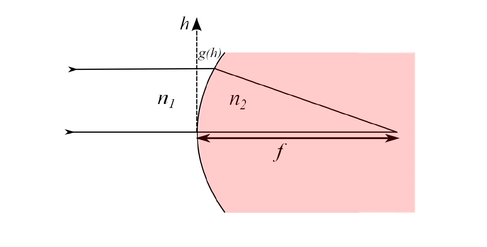

# Aberations as a function of Amplitude and Phase Mask:

## 0. Introduction
- In optical systems, aberrations are deviations from the ideal behavior of light propagation through lenses or other optical elements. These aberrations depend on various factors, including the position and angle at which a beam enters an optical component.
- Traditionally, we consider how the position and angle of incidence affect aberrations in a single lens, however in the context of holography it is insightfull to rephrase the problem in terms of phase and amplitude field just before the lens and ask how those affect the abberation map. 

## 1. Single Surface Lens:

To gain intuition about aberrations, lets follow the analysis from the Physics III notes by Jonathan Home @ ETH Zurich. Consider a collimated beam hitting a single-surface lens perpendicularly to the lens normal.

 

The total optical path taken for the ray starting at hieght _h_ is:

$$
n_1 g(h)+n_2\left(h^2+(f-g(h))^2\right)^{1 / 2}
$$

To ensure constructive interference for all rays (regardless of _h_), we need to find the stationary points of the optical path length with repsect to _h_. 

$$
n_1 g^{\prime}(h)+\frac{n_2\left(2 h-2(f-g(h)) g^{\prime}(h)\right)}{2\left(h^2+(f-g(h))^2\right)^{1 / 2}}=0
$$

Solutions to this equations are not simple, and as a result it is very tricky to manufacture perfect shape. Therefore, we often use spherical lenses, which are easier to produce but introduce imperfections.

For a spherical lens, the surface profile is:

$$
g(h)=R-\sqrt{\left(R^2-h^2\right)} \approx \frac{h^2}{2 R}+O\left[h^4\right]
$$

The focal length $f$ for this lens is:

$$
f=\frac{R}{\left(1-\frac{n_1}{n_2}\right)}
$$

However, spherical lenses introduce spherical aberration because the optical path difference is not perfectly corrected. The extra phase acquired by a beam entering at height $h$ is approximately:

$$
\frac{n_2+\frac{2 n_2^2}{n_1-n_2}+\frac{\left(n_1-n_2\right)\left(n_2-n_1\right)^3}{n_2^2}}{8} \frac{h^3}{f^3} h
$$

This analysis assumes a plane wave entering with a flat phase front. To understand the imperfections introduced when the phase front isn't flat, we would need to perform a similar analysis for each possible phase mask — a complex and challenging problem.

## 2. The Wave Equation and concept of propagators:

Electromagnetic field can be modelled as a complex field $U(x, y, z)$ that follows Helmholz equation $\nabla^2 U(\boldsymbol{r})=-\frac{\omega^2}{v^2} U(\boldsymbol{r})$.

We can transform $U$ into Fourier space:

$$
\begin{aligned}
\tilde{U}\left(k_x, k_y ; z\right) & =\frac{1}{2 \pi} \int_{-\infty}^{\infty} \int_{-\infty}^{\infty} U(x, y, z) \exp \left[-\mathrm{i}\left(k_x x+k_y y\right)\right] \mathrm{d} x \mathrm{~d} y 
\end{aligned}
$$

, where the Helmholz equation would takes form

$$
\frac{d^2 \tilde{U}}{d z^2}+\left(k^2-k_x^2-k_y^2\right) \tilde{U}\left(k_x, k_y ; z\right)=0
$$

The solution is:

$$
\tilde{U}\left(k_x, k_y ; z\right)=\tilde{U}\left(k_x, k_y ; 0\right) \exp \left(\mathrm{i} \sqrt{k^2-k_x^2-k_y^2} z\right)=\tilde{U}\left(k_x, k_y ; 0\right) \mathcal{H}\left(k_x, k_y, z\right)
$$

, where $\mathcal{H}\left(k_x, k_y, z\right)$ is a Helmholz propagator.

**Propagators:**

Using Green's theorem and the Fresnel-Kirchhoff diffraction formula, we can relate the field at any plane $z=z_0$ to a field at $z=0$ thrugh a propagator $\tau(x,y,z_0,x',y',0)$. Then we can write that 

$$U(x, y, z_0) = \int\int dx' dy' \left(\tau(x,y,z_0,x',y',0) U(x, y, 0) \right)
$$

In free space, it's advantageous to work in Fourier space due to the linearity of the equations, which reduces computational complexity.

When introducing a phase mask, multiplication in real space corresponds to convolution in Fourier space. This means the operation is linear in real space but becomes more intricate in Fourier space.

In general, the transformation can be expressed using the propagator $\tau(x,y,z,x',y',z')$. 

## 3. Representing field as a matrix:
To facilitate numerical computations, we can discretize the field and represent it as a matrix. The field becomes a rank-2 tensor $U_{nm}$, and the propagator becomes a rank-4 tensor $\tau_{klnm}$. The relationship between the fields at different planes is:

$$
U_{kl} = \tau_{klnm} U_{nm}
$$

We can define aberrations $\tau^{\Delta}_{klnm}$, as a difference in the actual propagator, $\tau_{klnm}$, and the ideal (aberation-free) propagator, $\tau^0_{klnm}$.

$$
\tau^{\Delta}_{klnm} = \tau_{klnm} - \tau^0_{klnm}
$$

## 4. Can we do not wavefront calibration, but rather propagator calibration?

Why was I thinking about this in the first place is my interest in the paper 'Rapid stochastic spatial light modulator calibration and pixel crosstalk optimisation'. I was wondering whether instead of learning the wavefront mask, we could learn the whole propagator. 

## Reversible Neural Network